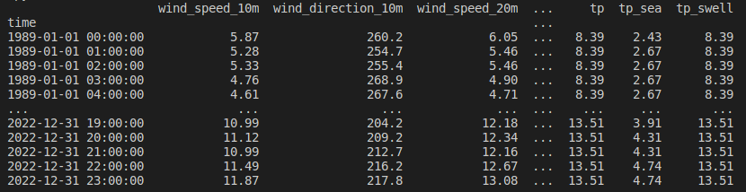
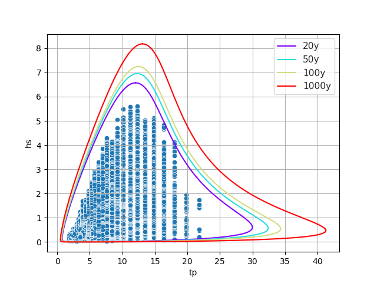

.. metocean_engine documentation master file, created by
   sphinx-quickstart on Thu Sep 14 10:18:36 2023.
   You can adapt this file completely to your liking, but it should at least
   contain the root `toctree` directive.

Welcome to metocean_engine's documentation!
=====================================

**metocean_engine** is a Python package for metocean analysis of NORA3 (wind and wave) hindcast.

The package contains functions that:
  * create time series and save in csv-format
  * generate statistics (tables, diagrams etc)

Installing **metocean-stats**
=============================================
1. Install anaconda3 or miniconda3
2. Clone metocean-stats:

.. code-block:: bash

   $ git clone https://github.com/MET-OM/metocean-stats.git
   $ cd metocean-stats/

3. Create environment with the required dependencies and install metocean-stats

.. code-block:: bash

  $ conda config --add channels conda-forge
  $ conda env create -f environment.yml
  $ conda activate metocean-stats
  $ pip install -e .
  
To update the enviroment using a new environment.yml, run:

.. code-block:: bash

   $ conda env update --file environment.yml --prune

Creating a TimeSeries-object
=====================================
This section document the **ts-module**. The ts-object is initialized with the following command:

.. code-block:: python

   from metocean_stats import ts
   ts = ts.TimeSeries(lon=1.320, lat=53.324,
                      start_time='1989-01-01', end_time='2022-12-31' , 
                      product='NORA3_wind_wave') 

Several options for **product** are available:

.. code-block:: bash
  
  # For combined wind and wave NORA3 data: product='NORA3_wind_wave'
  # For wind NORA3 data: product='NORA3_wind_sub'
  # For wave NORA3 data: product='NORA3_wave_sub'
  # For coastal wave NORA3 data: product='NORA3C_wave'
  # ERA5???

Import data from server to **ts-object** and save it as csv:

.. code-block:: python

   ts.import_ts(save_csv=True)

Data is saved in:

.. code-block:: python

   print(ts.datafile)  
   'NORA3_wind_wave_lon1.32_lat53.324_19890101_20221231.csv' 

To import data from a local csv-file to **ts-object**:

.. code-block:: python

   ts.load_ts(local_file=ts.datafile)  
   print(ts.data)

General Statistics
=====================================
To generate general/basic stastistics, import general_stats module: 

.. code-block:: python
   
   from metocean_engine.stats import general_stats as stats

Create scatter Hs-Tp diagram:

.. code-block:: python
   
   stats.scatter_diagram(var1=ts.data['hs'], step_var1=1, 
                     var2=ts.data['tp'], step_var2=2, 
                     output_file='scatter_hs_tp_diagram.png')

.. image:: scatter_hs_tp_diagram.png
  :width: 500

Create table with monthly percentiles:

.. code-block:: python

   stats.table_monthly_percentile(data=ts.data, var='hs', output_file='hs_monthly_perc.csv')

.. csv-table:: 
   :header-rows: 1

   Month , 5% , 50% , Mean , 95% , 99% 
   jan , 0.5 , 1.3 , 1.4 , 2.7 , 3.7 
   feb , 0.4 , 1.2 , 1.4 , 2.8 , 3.8 
   mar , 0.4 , 1.1 , 1.2 , 2.5 , 3.4 
   apr , 0.3 , 0.9 , 1.0 , 2.1 , 3.2 
   mai , 0.3 , 0.9 , 0.9 , 1.9 , 2.5 
   jun , 0.3 , 0.7 , 0.8 , 1.7 , 2.5 
   jul , 0.2 , 0.7 , 0.8 , 1.6 , 2.2 
   aug , 0.3 , 0.7 , 0.8 , 1.8 , 2.5 
   sep , 0.3 , 0.9 , 1.1 , 2.3 , 3.2 
   okt , 0.4 , 1.2 , 1.3 , 2.5 , 3.2 
   nov , 0.5 , 1.3 , 1.4 , 2.7 , 3.6 
   des , 0.4 , 1.3 , 1.4 , 2.8 , 3.5 
   Annual , 0.4 , 1.3 , 1.4 , 2.8 , 3.5

Create table with monthly min, mean, and max values:

.. code-block:: python

   stats.table_monthly_min_mean_max(data=ts.data, var='hs',output_file='hs_montly_min_mean_max.csv')

.. csv-table:: 
   :header-rows: 1

   Month , Minimum , Mean , Maximum 
   jan , 2.4 , 3.7 , 5.13 
   feb , 2.62 , 3.7 , 5.53 
   mar , 2.02 , 3.3 , 4.52 
   apr , 1.95 , 3.0 , 4.67 
   mai , 1.6 , 2.5 , 3.29 
   jun , 1.46 , 2.4 , 3.32 
   jul , 1.29 , 2.2 , 3.57 
   aug , 1.7 , 2.5 , 4.42 
   sep , 1.8 , 3.0 , 5.61 
   okt , 2.04 , 3.2 , 4.43 
   nov , 2.3 , 3.7 , 5.48 
   des , 2.46 , 3.6 , 5.14 
   Annual , 3.63 , 4.6 , 5.61 

Create table with sorted statistics by Hs:

.. code-block:: python

   stats.table_var_sorted_by_Hs(data=ts.data, var='tp', output_file='tp_sorted_by_hs.csv')

.. csv-table:: 
   :header-rows: 1

   Hs , Entries , Min , 5% , Mean , 95% , Max 
   0-1 , 140613 , 1.8 , 3.2 , 6.0 , 11.2 , 21.8 
   1-2 , 111055 , 3.6 , 4.3 , 6.8 , 12.3 , 21.8 
   2-3 , 24175 , 4.7 , 5.7 , 7.8 , 12.3 , 18.0 
   3-4 , 4058 , 6.3 , 6.9 , 9.8 , 13.5 , 18.0 
   4-5 , 571 , 7.6 , 9.2 , 11.6 , 14.9 , 18.0 
   5-6 , 40 , 9.2 , 10.2 , 11.8 , 14.9 , 14.9 
   6-7 , 0 , - , - , - , - , - 
   0-7 , 280512 , 1.8 , 3.6 , 6.5 , 11.2 , 21.8 

Directional Statistics
=====================================

To generate directional stastistics, import dir_stats module: 

.. code-block:: python
   
   from metocean_engine.stats import dir_stats as dir

Create rose for overall data (**method='overall'**) or for each month (**method='monthly'**):

.. code-block:: python
   
   dir.var_rose(ts.data, 'thq','hs','waverose.png',method='overall')

.. image:: waverose.png
  :width: 300

.. code-block:: python
   
   dir.var_rose(ts.data, 'thq','hs','waverose.png',method='monthly')

.. image:: monthly_waveroses.png
  :width: 500

Create table with min, mean, and maximum values as a function direction:

.. code-block:: python

   dir.directional_min_mean_max(ts.data,'thq','hs','hs_dir_min_mean_max.csv')

.. csv-table:: 
   :header-rows: 1

   Direction , Minimum , Mean , Maximum 
   345-15 , 2.2 , 2.8 , 3.7 
   15-45 , 2.2 , 3.0 , 4.0 
   45-75 , 2.4 , 3.3 , 4.3 
   75-105 , 2.5 , 3.3 , 4.1 
   105-135 , 2.3 , 3.4 , 4.2 
   135-165 , 2.8 , 4.1 , 5.5 
   165-195 , 3.0 , 4.2 , 5.6 
   195-225 , 1.9 , 3.4 , 5.5 
   225-255 , 1.9 , 3.1 , 4.8 
   255-285 , 2.0 , 2.9 , 4.4 
   285-315 , 2.0 , 2.7 , 4.2 
   315-345 , 2.0 , 2.9 , 4.1 
   Annual , 3.6 , 4.6 , 5.6 

Extreme Statistics
=====================================

To generate extreme stastistics, import extreme_stats module: 

.. code-block:: python
   
   from metocean_engine.stats import extreme_stats as extr

Compute a joint contour for  given return periods:

.. code-block:: python
   
   extr.joint_2D_contour(ts.data['hs'],ts.data['tp'], 
                         return_periods=[50,100,1000],
                         image_path='hs_tp_joint_2D_contour.png')

.. toctree::
   :maxdepth: 2
   :caption: Contents:
