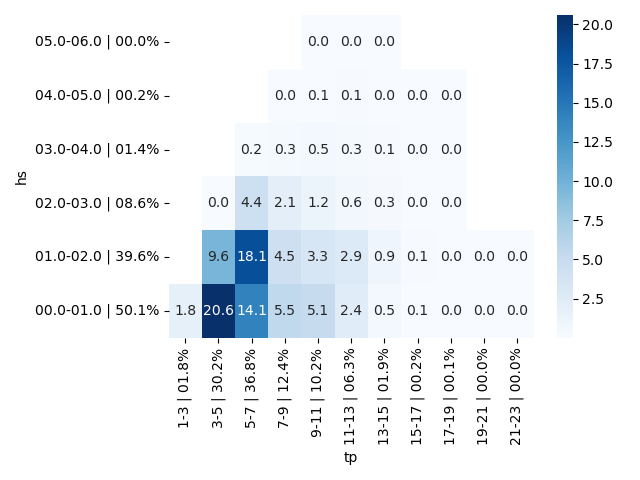
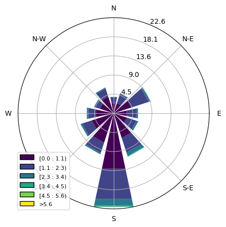
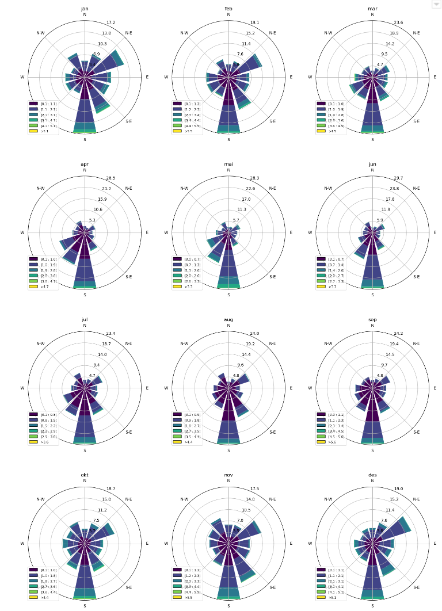
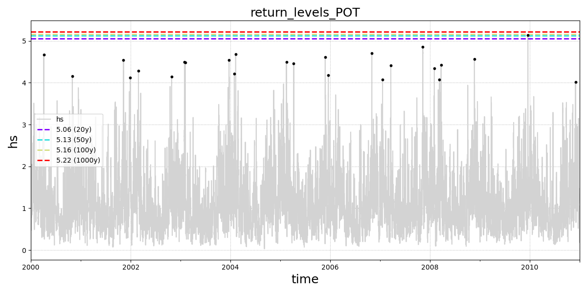
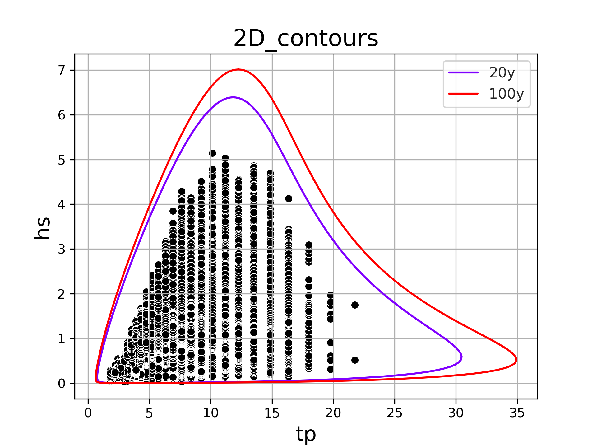
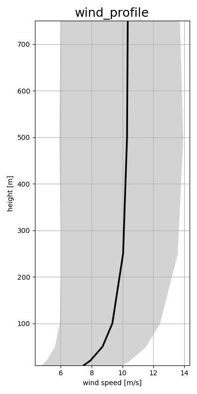

.. metocean-stats documentation master file, created by
   sphinx-quickstart on Thu Sep 14 10:18:36 2023.
   You can adapt this file completely to your liking, but it should at least
   contain the root `toctree` directive.

Welcome to metocean-stats's documentation!
=====================================

**metocean-stats** is a Python package (under developement) for metocean analysis of NORA3 (wind and wave) hindcast.

The package contains functions that:
  * generate statistics (tables, diagrams etc)

Installing **metocean-stats**
=============================================
Alternative 1: Using Mambaforge (alternative to Miniconda)
++++++++++++++++++++++++++++++++++++++++++++++++++++++++++

1. Install `mambaforge <https://mamba.readthedocs.io/en/latest/installation.html>`_ (`download <https://github.com/conda-forge/miniforge#mambaforge>`_)
2. Set up a *Python 3* environment for metocean-stats and install metocean-stats

.. code-block:: bash

   $ mamba create -n metocean-stats python=3 metocean-stats
   $ conda activate metocean-stats

Alternative 2: Using Mambaforge (alternative to Miniconda) and Git
++++++++++++++++++++++++++++++++++++++++++++++++++++++++++++++++++++++++++++
1. Install `mambaforge <https://mamba.readthedocs.io/en/latest/installation.html>`_ (`download <https://github.com/conda-forge/miniforge#mambaforge>`_)
2. Clone metocean-stats:

.. code-block:: bash

   $ git clone https://github.com/MET-OM/metocean-stats.git
   $ cd metocean-stats/

3. Create environment with the required dependencies and install metocean-stats

.. code-block:: bash

  $ mamba env create -f environment.yml
  $ conda activate metocean-stats
  $ pip install --no-deps -e .

This installs the metocean-stats as an editable package. Therefore, you can directly make changes to the repository or fetch the newest changes with :code:`git pull`. 

To update the local conda environment in case of new dependencies added to environment.yml:

.. code-block:: bash

  $ mamba env update -f environment.yml

Download metocean data
=====================================
Use metocean-api to download some sample data:

.. code-block:: python

   from metocean_api import ts
   ds = ts.TimeSeries(lon=1.320, lat=53.324,
                      start_time='2000-01-01', 
                      end_time='2000-12-31', 
                      product='NORA3_wind_wave')

Import data from server and save it as csv:

.. code-block:: python

   ds.import_data(save_csv=True)

Or import data from a local csv-file:

.. code-block:: python

   ds.load_data(local_file=ts.datafile)  

General Statistics
=====================================
To generate general/basic stastistics, import general_stats module: 

.. code-block:: python
   
   from metocean_stats.stats import general_stats

Create scatter Hs-Tp diagram:

.. code-block:: python
   
   general_stats.scatter_diagram(data=ts.data, 
                     var1='hs', step_var1=1, 
                     var2='tp', step_var2=2, 
                     output_file='scatter_hs_tp_diagram.png')

Create table with monthly percentiles:

.. code-block:: python

   general_stats.table_monthly_percentile(data=ts.data, var='hs', output_file='hs_monthly_perc.csv')

.. csv-table:: 
   :header-rows: 1

   Month , 5% , 50% , Mean , 95% , 99% 
   jan , 0.5 , 1.3 , 1.4 , 2.7 , 3.7 
   feb , 0.4 , 1.2 , 1.4 , 2.8 , 3.8 
   mar , 0.4 , 1.1 , 1.2 , 2.5 , 3.4 
   apr , 0.3 , 0.9 , 1.0 , 2.1 , 3.2 
   mai , 0.3 , 0.9 , 0.9 , 1.9 , 2.5 
   jun , 0.3 , 0.7 , 0.8 , 1.7 , 2.5 
   jul , 0.2 , 0.7 , 0.8 , 1.6 , 2.2 
   aug , 0.3 , 0.7 , 0.8 , 1.8 , 2.5 
   sep , 0.3 , 0.9 , 1.1 , 2.3 , 3.2 
   okt , 0.4 , 1.2 , 1.3 , 2.5 , 3.2 
   nov , 0.5 , 1.3 , 1.4 , 2.7 , 3.6 
   des , 0.4 , 1.3 , 1.4 , 2.8 , 3.5 
   Annual , 0.4 , 1.3 , 1.4 , 2.8 , 3.5

Create table with monthly min, mean, and max based on monthly values:

.. code-block:: python

   general_stats.table_monthly_min_mean_max(data=ts.data, var='hs',output_file='hs_montly_min_mean_max.csv')

.. csv-table:: 
   :header-rows: 1

   Month , Minimum , Mean , Maximum 
   jan , 2.4 , 3.7 , 5.13 
   feb , 2.62 , 3.7 , 5.53 
   mar , 2.02 , 3.3 , 4.52 
   apr , 1.95 , 3.0 , 4.67 
   mai , 1.6 , 2.5 , 3.29 
   jun , 1.46 , 2.4 , 3.32 
   jul , 1.29 , 2.2 , 3.57 
   aug , 1.7 , 2.5 , 4.42 
   sep , 1.8 , 3.0 , 5.61 
   okt , 2.04 , 3.2 , 4.43 
   nov , 2.3 , 3.7 , 5.48 
   des , 2.46 , 3.6 , 5.14 
   Annual , 3.63 , 4.6 , 5.61 

Create table with sorted statistics by Hs:

.. code-block:: python

   general_stats.table_var_sorted_by_hs(data=ts.data, var='tp', var_hs='hs', output_file='tp_sorted_by_hs.csv')

.. csv-table:: 
   :header-rows: 1

   Hs , Entries , Min , 5% , Mean , 95% , Max 
   0-1 , 140613 , 1.8 , 3.2 , 6.0 , 11.2 , 21.8 
   1-2 , 111055 , 3.6 , 4.3 , 6.8 , 12.3 , 21.8 
   2-3 , 24175 , 4.7 , 5.7 , 7.8 , 12.3 , 18.0 
   3-4 , 4058 , 6.3 , 6.9 , 9.8 , 13.5 , 18.0 
   4-5 , 571 , 7.6 , 9.2 , 11.6 , 14.9 , 18.0 
   5-6 , 40 , 9.2 , 10.2 , 11.8 , 14.9 , 14.9 
   6-7 , 0 , - , - , - , - , - 
   0-7 , 280512 , 1.8 , 3.6 , 6.5 , 11.2 , 21.8 

Directional Statistics
=====================================

To generate directional stastistics, import dir_stats module: 

.. code-block:: python
   
   from metocean_stats.stats import dir_stats

Create rose for overall data (**method='overall'**) or for each month (**method='monthly'**):

.. code-block:: python
   
   dir_stats.var_rose(ts.data, 'thq','hs','waverose.png',method='overall')

.. code-block:: python
   
   dir_stats.var_rose(ts.data, 'thq','hs','waverose.png',method='monthly')

Create table with min, mean, and maximum values as a function direction:

.. code-block:: python

   dir_stats.directional_min_mean_max(ts.data,'thq','hs','hs_dir_min_mean_max.csv')

.. csv-table:: 
   :header-rows: 1

   Direction , Minimum , Mean , Maximum 
   345-15 , 2.2 , 2.8 , 3.7 
   15-45 , 2.2 , 3.0 , 4.0 
   45-75 , 2.4 , 3.3 , 4.3 
   75-105 , 2.5 , 3.3 , 4.1 
   105-135 , 2.3 , 3.4 , 4.2 
   135-165 , 2.8 , 4.1 , 5.5 
   165-195 , 3.0 , 4.2 , 5.6 
   195-225 , 1.9 , 3.4 , 5.5 
   225-255 , 1.9 , 3.1 , 4.8 
   255-285 , 2.0 , 2.9 , 4.4 
   285-315 , 2.0 , 2.7 , 4.2 
   315-345 , 2.0 , 2.9 , 4.1 
   Annual , 3.6 , 4.6 , 5.6 

Extreme Statistics
=====================================

To generate extreme stastistics, import extreme_stats module: 

.. code-block:: python
   
   from metocean_stats.stats import extreme_stats

Create time series of Hs with return levels using POT and Annual Maximum(GEV):

.. code-block:: python
   
   rl_pot = extreme_stats.return_levels_pot(data=ds.data, var='hs', 
            periods=[20,50,100,1000], 
            output_file='return_levels_POT.png')

.. code-block:: python
   
   rl_am = extreme_stats.return_levels_annual_max(data=ds.data, var='hs', 
           periods=[20,50,100,1000],method='GEV',
           output_file='return_levels_GEV.png')

.. image:: return_levels_GEV.png
  :width: 700   

Plot joint Hs-Tp contours for different return periods (to get the contour values use: extreme_stats.get_joint_2D_contour):

.. code-block:: python
   
   extreme_stats.plot_joint_2D_contour(data=ds.data,var1='hs',var2='tp', periods=[50,100], 
                                       output_file='2D_contours.png')

Profile Statistics
=====================================
To generate profile stastistics, import profile_stats module: 

.. code-block:: python
   
   from metocean_stats.stats import profile_stats

Estimate and plot mean wind profile with percentiles in shaded region:

.. code-block:: python
   
   mean_prof = profile_stats.mean_profile(data = ds.data, vars = 
                ['wind_speed_10m','wind_speed_20m','wind_speed_50m',
                'wind_speed_100m','wind_speed_250m','wind_speed_500m',
                'wind_speed_750m'],
                height_levels=[10,20,50,100,250,500,750],
                perc=[25,75], 
                output_file='wind_profile.png')

Calculate the wind speed shear over any two heights of the input profile and plot in a histogram and output shear values. Percentiles are shown as shaded region.:
.. code-block:: python

profile_stats.profile_shear(data = ds.data, vars =       
                ['wind_speed_10m','wind_speed_20m','wind_speed_50m',
                'wind_speed_100m','wind_speed_250m','wind_speed_500m',
                'wind_speed_750m'],
                height_levels=[10,20,50,100,250,500,750], 
                z=[20,250], 
                perc = [25,75], 
                output_file='wind_profile_shear.png')

.. image:: wind_profile_shear.png
  :width: 500

.. toctree::
   :maxdepth: 2
   :caption: Contents:
