Welcome to metocean-stats's documentation!
==========================================

**metocean-stats** is a Python package (under development) for metocean analysis of NORA3 (wind and wave) hindcast.

The package contains functions that:
  * generate statistics (tables, diagrams etc)

Installing **metocean-stats**
=============================

Alternative 1: Using Mambaforge (alternative to Miniconda)
----------------------------------------------------------

1. Install `mambaforge <https://mamba.readthedocs.io/en/latest/installation.html>`_ (`download <https://github.com/conda-forge/miniforge#mambaforge>`_)
2. Set up a *Python 3* environment for metocean-stats and install metocean-stats

.. code-block:: bash

   $ mamba create -n metocean-stats python=3 metocean-stats
   $ conda activate metocean-stats

Alternative 2: Using Mambaforge (alternative to Miniconda) and Git
------------------------------------------------------------------

1. Install `mambaforge <https://mamba.readthedocs.io/en/latest/installation.html>`_ (`download <https://github.com/conda-forge/miniforge#mambaforge>`_)
2. Clone metocean-stats:

.. code-block:: bash

   $ git clone https://github.com/MET-OM/metocean-stats.git
   $ cd metocean-stats/

3. Create environment with the required dependencies and install metocean-stats

.. code-block:: bash

   $ mamba env create -f environment.yml
   $ conda activate metocean-stats
   $ pip install --no-deps -e .

This installs the metocean-stats as an editable package. Therefore, you can directly make changes to the repository or fetch the newest changes with :code:`git pull`. 

To update the local conda environment in case of new dependencies added to environment.yml:

.. code-block:: bash

   $ mamba env update -f environment.yml

Metocean Statistics
===================

Import plots and tables from metocean-stats:

.. code-block:: python
   
   from metocean_stats import plots, tables

Scatter Plot
------------

.. code-block:: python
   
   plots.plot_scatter(
      df,
      var1='W10',
      var2='W100',
      var1_units='m/s',
      var2_units='m/s', 
      title='Scatter',
      regression_line=True,
      qqplot=False,
      density=True,
      output_file='scatter_plot.png')

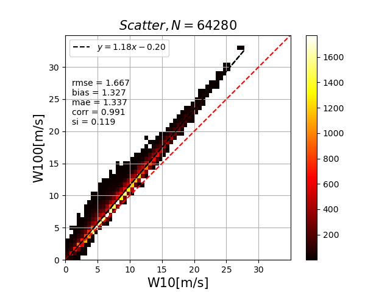

Scatter Diagram
---------------

.. code-block:: python
   
   tables.scatter_diagram(
       ds, 
       var1='HS', 
       step_var1=1, 
       var2='TP', 
       step_var2=1, 
       output_file='Hs_Tp_scatter.csv'
   )

.. csv-table:: Scatter diagram
   :header-rows: 1
   :file: files/Hs_Tp_scatter.csv

.. code-block:: python
   
   tables.scatter_diagram(
       ds, 
       var1='HS', 
       step_var1=1, 
       var2='TP', 
       step_var2=1, 
       output_file='Hs_Tp_scatter.png'
   )

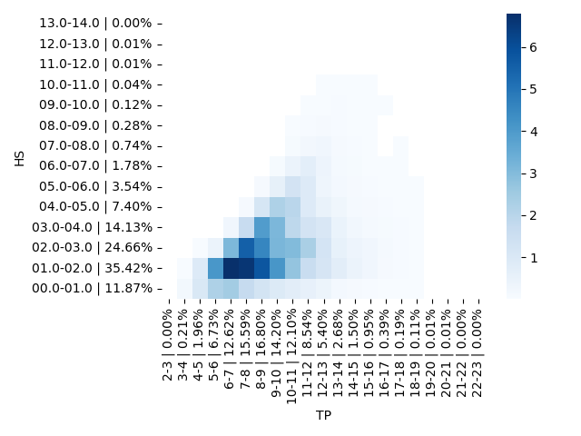

Wind Profile Return Values Table
--------------------------------

.. code-block:: python

   tables.table_profile_return_values(
       df,
       var=['W10', 'W', 'W80', 'W100', 'W1'],
       z=[10, , 80, 100, 1],
       periods=[1, 10, 100, 10000],
       output_file='RVE_wind_profile.csv'
   )

.. csv-table:: 
   :header-rows: 1
   :file: files/RVE_wind_profile.csv

Wind Profile Return Values Plot
-------------------------------

.. code-block:: python

   plots.plot_profile_return_values(
       df,
       var=['W10', 'W', 'W80', 'W100', 'W1'],
       z=[10, , 80, 100, 1],
       periods=[1, 10, 100, 10000],
       reverse_yaxis=False,
       title='Return Periods over z',
       units='m/s',
       distribution='Weibull3P',
       method='default',
       threshold='default',
       output_file='RVE_wind_profile.png'
   )

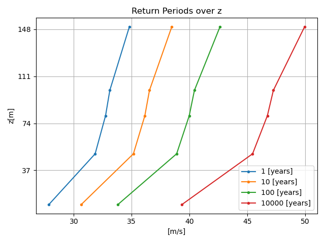

Wind Profile Statistics Plot
----------------------------

.. code-block:: python

   plots.plot_profile_stats(
       df,
       var=['W10', 'W', 'W80', 'W100', 'W1'],
       z=[10, , 80, 100, 1],
       reverse_yaxis=False,
       output_file='wind_stats_profile.png'
   )

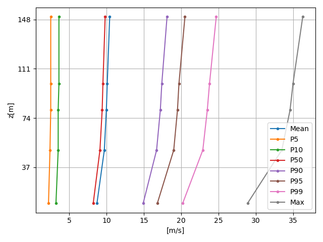

Directional Wind Return Periods (NORSOK Adjustment)
---------------------------------------------------

.. code-block:: python

   plots.plot_directional_return_periods(
       df,
       var='W10',
       var_dir='D10',
       periods=[1, 10, 100, 1000],
       distribution='Weibull3P_MOM',
       adjustment='NORSOK',
       units='m/s',
       output_file='Wind.dir_extremes_weibull_norsok.png'
   )

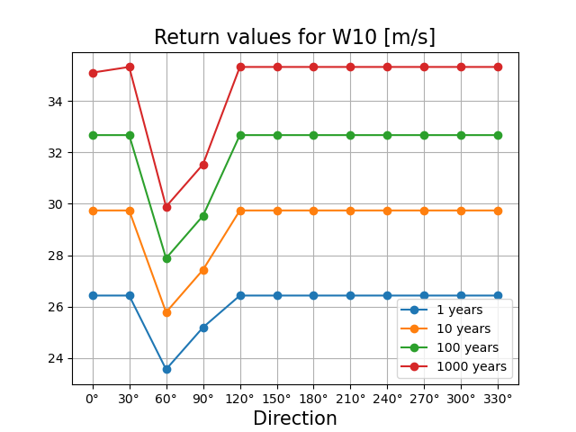

Directional Wind Return Periods (No Adjustment)
-----------------------------------------------

.. code-block:: python

   plots.plot_directional_return_periods(
       df,
       var='W10',
       var_dir='D10',
       periods=[1, 10, 100, 1000],
       distribution='Weibull3P_MOM',
       adjustment=None,
       units='m/s',
       output_file='Wind.dir_extremes_weibull.png'
   )

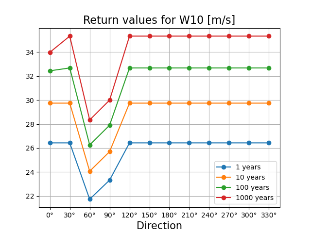

Monthly Non-Exceedance Table
----------------------------

.. code-block:: python

   tables.table_monthly_non_exceedance(
       df, 
       var='HS', 
       step_var=0.5, 
       output_file='Hs_table_monthly_non_exceedance.csv'
   )

.. csv-table:: 
   :header-rows: 1
   :file: files/Hs_table_monthly_non_exceedance.csv

Monthly Statistics Plot
------------------------

.. code-block:: python

   plots.plot_monthly_stats(
       df, 
       var='HS', 
       show=['Maximum','P99','Mean'], 
       title='Hs[m]', 
       output_file='Hs_monthly_stats.png'
   )

.. image:: files/Hs_monthly_stats.png
   :width: 500

Directional Non-Exceedance Table
--------------------------------

.. code-block:: python

   tables.table_directional_non_exceedance(
       df, 
       var='HS', 
       step_var=0.5, 
       var_dir='DIRM', 
       output_file='table_directional_non_exceedance.csv'
   )

.. csv-table:: 
   :header-rows: 1
   :file: files/table_directional_non_exceedance.csv

Directional Statistics Plot
----------------------------

.. code-block:: python

   plots.plot_directional_stats(
       df, 
       var='HS', 
       step_var=0.5, 
       var_dir='DIRM', 
       title='$H_s$[m]', 
       output_file='directional_stats.png'
   )

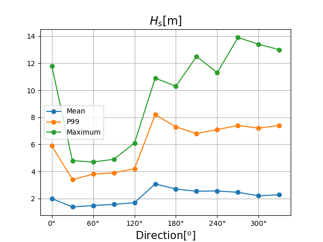

Prob. of Non-Exceedance (fitted)
--------------------------------

.. code-block:: python
   
   plots.plot_prob_non_exceedance_fitted_3p_weibull(df,
                                                    var='HS',
                                                    output_file='prob_non_exceedance_fitted_3p_weibull.png')

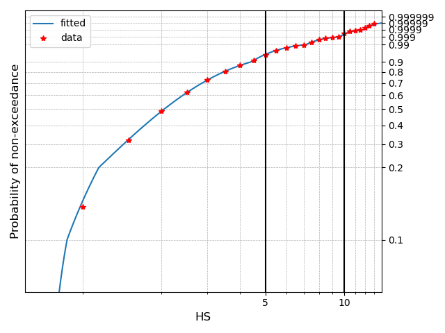

Joint Distribution Hs-Tp Plot
------------------------------

.. code-block:: python

   plots.plot_joint_distribution_Hs_Tp(
       df, 
       var_hs='HS', 
       var_tp='TP', 
       periods=[1,10,100,1000], 
       title='Hs-Tp joint distribution', 
       output_file='Hs.Tp.joint.distribution.png', 
       density_plot=True
   )

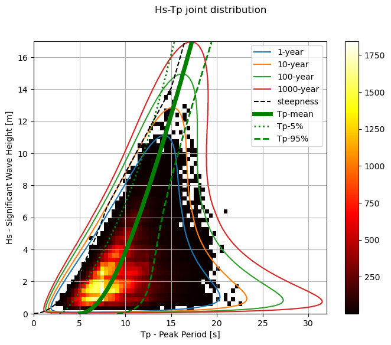

Monthly Joint Distribution Hs-Tp Parameter Table
------------------------------------------------

.. code-block:: python

   tables.table_monthly_joint_distribution_Hs_Tp_param(
       df, 
       var_hs='HS', 
       var_tp='TP', 
       periods=[1,10,100,10000], 
       output_file='monthly_Hs_Tp_joint_param.csv'
   )

.. csv-table:: 
   :header-rows: 1
   :file: files/monthly_Hs_Tp_joint_param.csv

Directional Joint Distribution Hs-Tp Parameter Table
----------------------------------------------------

.. code-block:: python

   tables.table_directional_joint_distribution_Hs_Tp_param(
       df, 
       var_hs='HS', 
       var_tp='TP', 
       var_dir='DIRM', 
       periods=[1,10,100], 
       output_file='dir_Hs_Tp_joint_param.csv'
   )

.. csv-table:: 
   :header-rows: 1
   :file: files/dir_Hs_Tp_joint_param.csv

Monthly Weather Window Plot
---------------------------

.. code-block:: python

   plots.plot_monthly_weather_window(
       df, 
       var='HS', 
       threshold=4, 
       window_size=12, 
       output_file='NORA10_monthly_weather_window4_12_plot.png'
   )

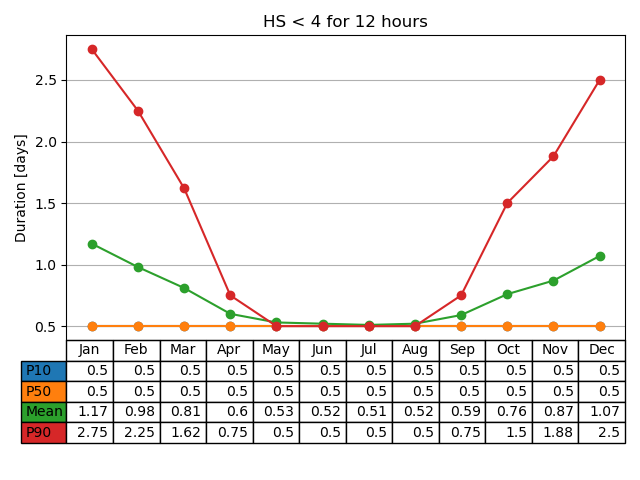

Number Of Hours Per Year Below A Threshold Plot
---------------------------

.. code-block:: python

   plots.plot_nb_hours_below_threshold(
       df, 
       var='HS', 
       thr_arr=(np.arange(0.05,20.05,0.05)).tolist(),
       output_file='number_hours_per_year.png'
   )

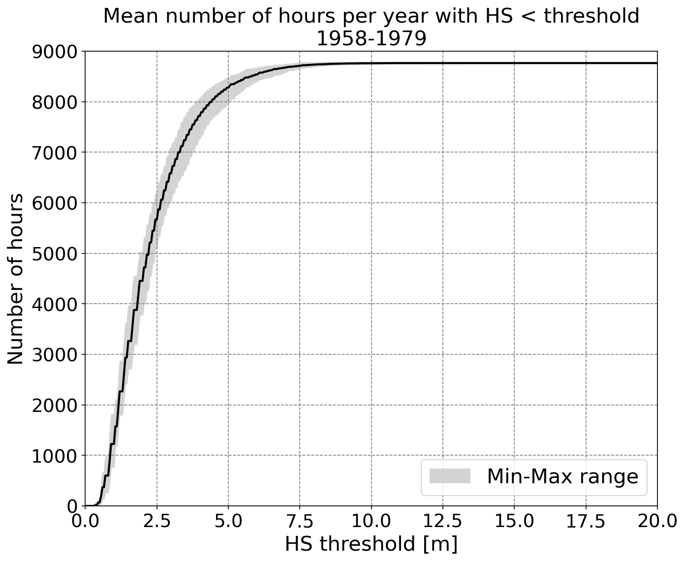

Number Of Hours Per Year Below A Threshold Table
---------------------------

.. code-block:: python

   tables.table_nb_hours_below_threshold(
       df,
       var='HS', 
       threshold=[1,2,3,4,5,6,7,8,9,10],
       output_file='number_hours_per_year.csv'
   )

.. csv-table:: 
   :header-rows: 1
   :file: files/nb_hour_below_thr.csv

All-Year Round Weather Window For Hs Under A Threshold Table
---------------------------

.. code-block:: python

   tables.table_weather_window_thresholds(
       df,
       var='HS', 
       threshold=[0.5,1,2],
       op_duration=[6,12,24,48],
       output_file='weather_window_thresholds.csv'
   )

.. csv-table:: 
   :header-rows: 1
   :file: files/weather_window_thresholds.csv

Monthly Return Periods Table
----------------------------

.. code-block:: python

   tables.table_monthly_return_periods(
       df, 
       var='HS', 
       periods=[1, 10, 100, 10000], 
       distribution='Weibull3P_MOM', 
       units='m', 
       output_file='HS_monthly_extremes_Weibull.csv'
   )

.. csv-table:: 
   :header-rows: 1
   :file: files/HS_monthly_extremes_Weibull.csv

Directional Return Periods Table
--------------------------------

.. code-block:: python

   tables.table_directional_return_periods(
       df, 
       var='HS', 
       periods=[1, 10, 100, 10000], 
       units='m', 
       var_dir='DIRM', 
       distribution='Weibull3P_MOM', 
       adjustment='NORSOK', 
       output_file='directional_extremes_weibull.csv'
   )

.. csv-table:: 
   :header-rows: 1
   :file: files/directional_extremes_weibull.csv

Monthly Return Periods Plot
---------------------------

.. code-block:: python

   plots.plot_monthly_return_periods(
       df, 
       var='HS', 
       periods=[1, 10, 100], 
       distribution='Weibull3P_MOM', 
       units='m', 
       output_file='HS_monthly_extremes.png'
   )

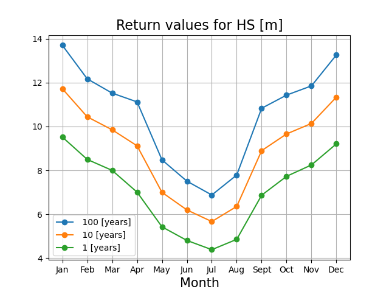

Directional Return Periods Plot (GUM)
-------------------------------------

.. code-block:: python

   plots.plot_directional_return_periods(
       df, 
       var='HS', 
       var_dir='DIRM', 
       periods=[1, 10, 100, 10000], 
       distribution='GUM', 
       units='m', 
       output_file='dir_extremes_GUM.png'
   )

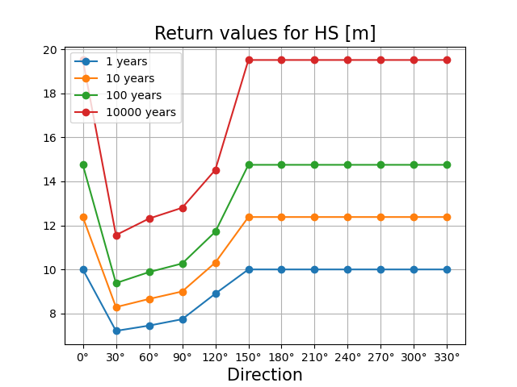

Directional Return Periods Plot (Weibull)
-----------------------------------------

.. code-block:: python

   plots.plot_directional_return_periods(
       df, 
       var='HS', 
       var_dir='DIRM', 
       periods=[1, 10, 100, 10000], 
       distribution='Weibull3P_MOM', 
       units='m', 
       adjustment='NORSOK', 
       output_file='dir_extremes_Weibull_norsok.png'
   )

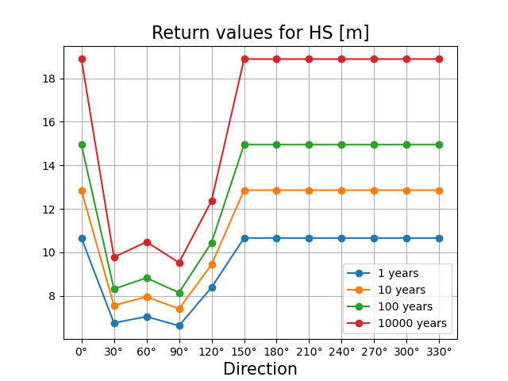

Monthly Joint Distribution Hs-Tp Return Values Table
----------------------------------------------------

.. code-block:: python

   tables.table_monthly_joint_distribution_Hs_Tp_return_values(
       df, 
       var_hs='HS', 
       var_tp='TP', 
       periods=[1,10,100,10000], 
       output_file='monthly_Hs_Tp_joint_return_values.csv'
   )

.. csv-table:: 
   :header-rows: 1
   :file: files/monthly_Hs_Tp_joint_return_values.csv

Directional Joint Distribution Hs-Tp Return Values Table
--------------------------------------------------------

.. code-block:: python

   tables.table_directional_joint_distribution_Hs_Tp_return_values(
       df, 
       var_hs='HS', 
       var_tp='TP', 
       var_dir='DIRM', 
       periods=[1,10,100,1000], 
       adjustment='NORSOK', 
       output_file='directional_Hs_Tp_joint_return_values.csv'
   )

.. csv-table:: 
   :header-rows: 1
   :file: files/directional_Hs_Tp_joint_return_values.csv

Hs-Tp Return Values Table
-------------------------

.. code-block:: python

   tables.table_Hs_Tpl_Tph_return_values(
       df, 
       var_hs='HS', 
       var_tp='TP', 
       periods=[1,10,100,10000], 
       output_file='hs_tpl_tph_return_values.csv'
   )

.. csv-table:: 
   :header-rows: 1
   :file: files/hs_tpl_tph_return_values.csv

Tp for Given Hs Plot
--------------------

.. code-block:: python

   plots.plot_tp_for_given_hs(
       df, 
       var_hs='HS', 
       var_tp='TP', 
       output_file='tp_for_given_hs.png'
   )

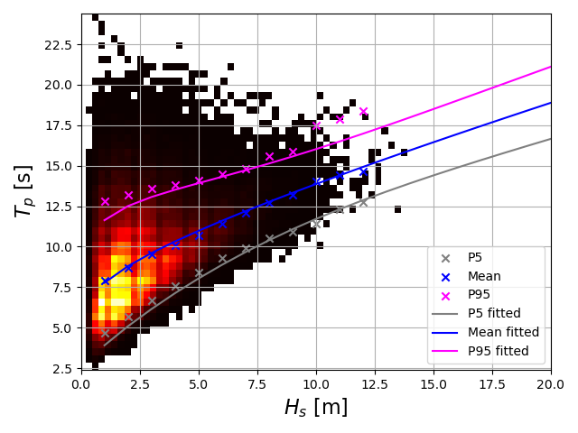

Tp for Given Hs Table
---------------------

.. code-block:: python

   tables.table_tp_for_given_hs(
       df, 
       var_hs='HS', 
       var_tp='TP', 
       max_hs=20, 
       output_file='tp_for_given_hs.csv'
   )

.. csv-table:: 
   :header-rows: 1
   :file: files/tp_for_given_hs.csv

Tp for RV Hs Table
------------------

.. code-block:: python

   tables.table_tp_for_rv_hs(
       df, 
       var_hs='HS', 
       var_tp='TP', 
       periods=[1,10,100,10000], 
       output_file='tp_for_rv_hs.csv'
   )

.. csv-table:: 
   :header-rows: 1
   :file: files/tp_for_rv_hs.csv

Wave-Induced Current (JONSWAP) Table
------------------------------------

.. code-block:: python

   tables.table_wave_induced_current(
       df, 
       var_hs='HS', 
       var_tp='TP', 
       depth=200, 
       ref_depth=200, 
       spectrum='JONSWAP', 
       output_file='JONSWAP_wave_induced_current_depth200.csv'
   )

.. csv-table:: 
   :header-rows: 1
   :file: files/JONSWAP_wave_induced_current_depth200.csv

Wave-Induced Current (TORSEHAUGEN) Table
----------------------------------------

.. code-block:: python

   tables.table_wave_induced_current(
       df, 
       var_hs='HS', 
       var_tp='TP', 
       depth=200, 
       ref_depth=200, 
       spectrum='TORSEHAUGEN', 
       output_file='TORSEHAUGEN_wave_induced_current_depth200.csv'
   )

.. csv-table:: 
   :header-rows: 1
   :file: files/TORSEHAUGEN_wave_induced_current_depth200.csv

Hs for Given Wind Table
-----------------------

.. code-block:: python

   tables.table_hs_for_given_wind(
       df, 
       var_hs='HS', 
       var_wind='W10', 
       bin_width=2, 
       max_wind=42, 
       output_file='table_perc_hs_for_wind.csv'
   )

.. csv-table:: 
   :header-rows: 1
   :file: files/table_perc_hs_for_wind.csv

Hs for Given Wind Plot
----------------------

.. code-block:: python

   plots.plot_hs_for_given_wind(
       df, 
       var_hs='HS', 
       var_wind='W10', 
       output_file='hs_for_given_wind.png'
   )

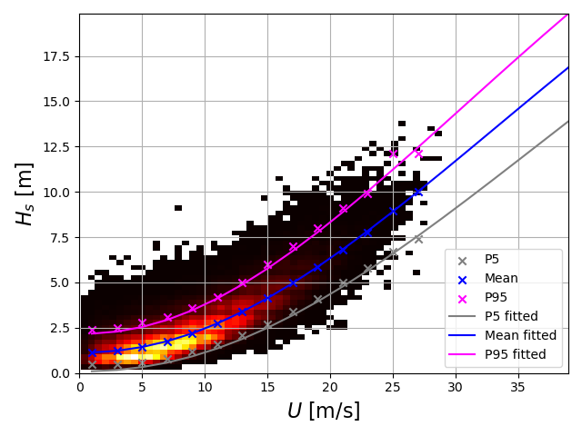

Hs for RV Wind Table
--------------------

.. code-block:: python

   tables.table_hs_for_rv_wind(
       df, 
       var_wind='W10', 
       var_hs='HS', 
       periods=[1,10,100,10000], 
       output_file='hs_for_rv_wind.csv'
   )

.. csv-table:: 
   :header-rows: 1
   :file: files/hs_for_rv_wind.csv

Hmax Return Values Table
------------------------

.. code-block:: python

   tables.table_Hmax_crest_return_periods(
       df, 
       var_hs='HS', 
       var_tp='TP', 
       depth=200, 
       periods=[1, 10, 100, 10000], 
       sea_state='long-crested'
   )

Directional Hmax Return Values Table
------------------------------------

.. code-block:: python

   tables.table_directional_Hmax_return_periods(
       df, 
       var_hs='HS', 
       var_tp='TP', 
       var_dir='DIRM', 
       periods=[10, 100, 10000], 
       adjustment='NORSOK', 
       output_file='table_dir_Hmax_return_values.csv'
   )

.. csv-table:: 
   :header-rows: 1
   :file: files/table_dir_Hmax_return_values.csv

T2m Monthly Return Periods Plot (Negative)
------------------------------------------

.. code-block:: python

   plots.plot_monthly_return_periods(
       df, 
       var='T2m', 
       periods=[1, 10, 100], 
       distribution='GUM_L', 
       method='minimum', 
       units='°C', 
       output_file='T2m_monthly_extremes_neg.png'
   )

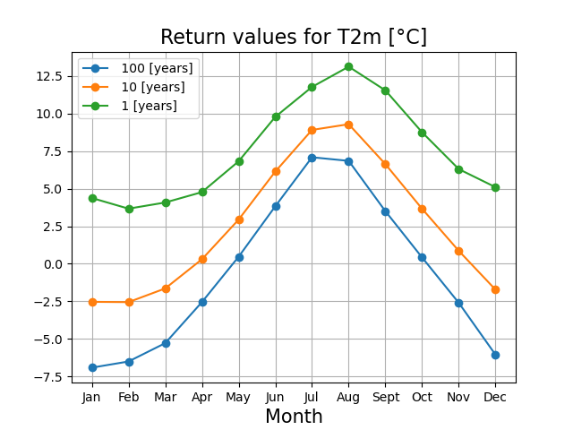

T2m Monthly Return Periods Table (Negative)
-------------------------------------------

.. code-block:: python

   tables.table_monthly_return_periods(
       df, 
       var='T2m', 
       periods=[1, 10, 100], 
       distribution='GUM_L', 
       method='minimum', 
       units='°C', 
       output_file='T2m_monthly_extremes_neg.csv'
   )

.. csv-table:: 
   :header-rows: 1
   :file: files/T2m_monthly_extremes_neg.csv

T2m Monthly Return Periods Plot (Positive)
------------------------------------------

.. code-block:: python

   plots.plot_monthly_return_periods(
       df, 
       var='T2m', 
       periods=[1, 10, 100], 
       distribution='GUM', 
       method='maximum', 
       units='°C', 
       output_file='T2m_monthly_extremes_pos.png'
   )

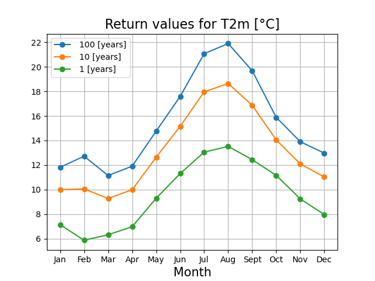

T2m Monthly Return Periods Table (Positive)
-------------------------------------------

.. code-block:: python

   tables.table_monthly_return_periods(
       df, 
       var='T2m', 
       periods=[1, 10, 100], 
       distribution='GUM', 
       method='maximum', 
       units='°C', 
       output_file='T2m_monthly_extremes_pos.csv'
   )

.. csv-table:: 
   :header-rows: 1
   :file: files/T2m_monthly_extremes_pos.csv

T2m Monthly Statistics Plot
---------------------------

.. code-block:: python

   plots.plot_monthly_stats(
       df, 
       var='T2m', 
       show=['Minimum','Mean','Maximum'], 
       title='T2m', 
       output_file='T2m_monthly_stats.png'
   )

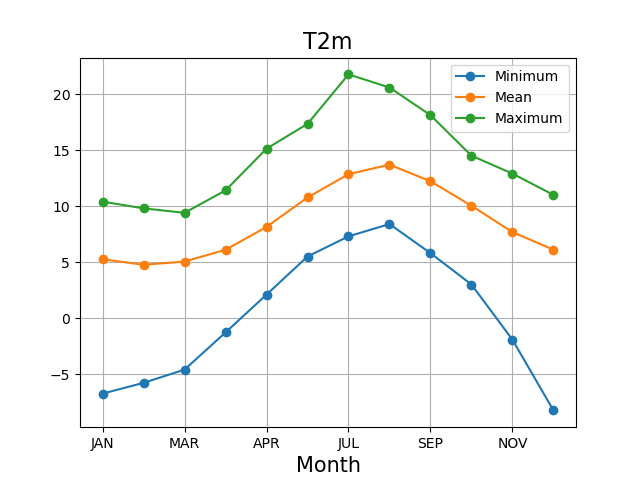

T2m Monthly Non-Exceedance Table
--------------------------------

.. code-block:: python

   tables.table_monthly_non_exceedance(
       df, 
       var='T2m', 
       step_var=0.5, 
       output_file='T2m_table_monthly_non_exceedance.csv'
   )

Current Speed Monthly Return Periods Plot
-----------------------------------------

.. code-block:: python

   plots.plot_monthly_return_periods(
       ds_ocean, 
       var='current_speed_0m', 
       periods=[1, 10, 100], 
       distribution='Weibull3P_MOM', 
       method='POT', 
       threshold='P99', 
       units='m/s', 
       output_file='csp0m_monthly_extremes.png'
   )

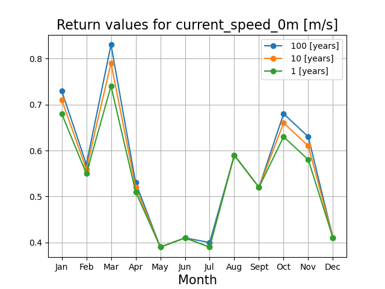

Current Speed Monthly Rose Plot
-------------------------------

.. code-block:: python

   plots.var_rose(
       ds_ocean, 
       'current_direction_0m', 
       'current_speed_0m', 
       max_perc=30, 
       decimal_places=2, 
       units='m/s', 
       method='monthly', 
       output_file='monthly_rose.png'
   )

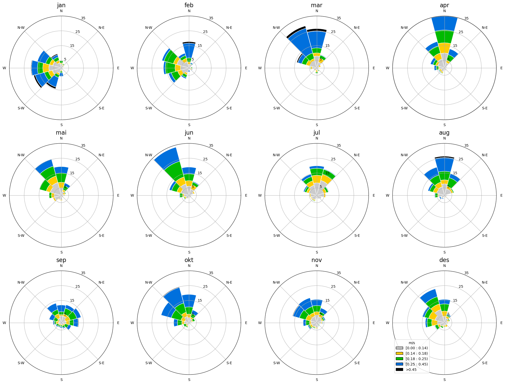

Current Speed Overall Rose Plot
-------------------------------

.. code-block:: python

   plots.var_rose(
       ds_ocean, 
       'current_direction_0m', 
       'current_speed_0m', 
       max_perc=30, 
       decimal_places=2, 
       units='m/s', 
       method='overall', 
       output_file='overall_rose.png'
   )

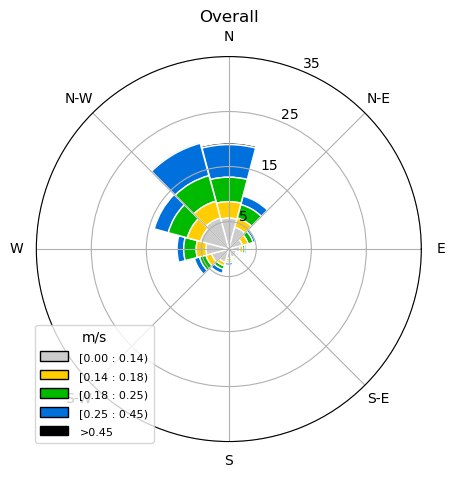

Current Speed Monthly Statistics Plot
-------------------------------------

.. code-block:: python

   plots.plot_monthly_stats(
       ds_ocean, 
       var='current_speed_0m', 
       show=['Mean', 'P99', 'Maximum'], 
       title='Current[m/s], depth:0m', 
       output_file='current_0m_monthly_stats.png'
   )

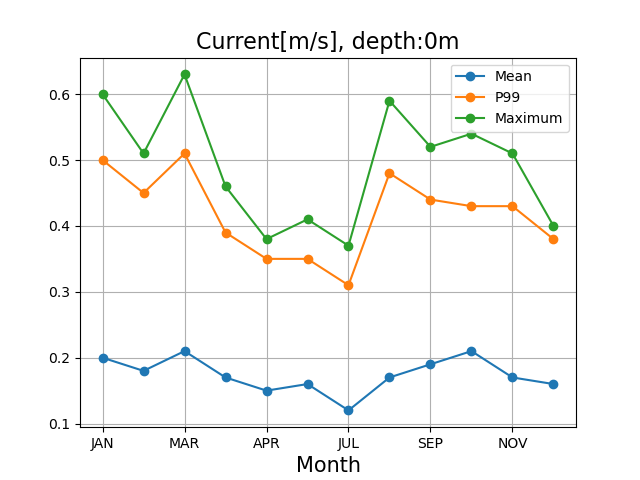

Current Speed Directional Statistics Plot
-----------------------------------------

.. code-block:: python

   plots.plot_directional_stats(
       ds_ocean, 
       var='current_speed_0m', 
       var_dir='current_direction_0m', 
       step_var=0.05, 
       show=['Mean', 'P99', 'Maximum'], 
       title='Current[m/s], depth:0m', 
       output_file='current_0m_dir_stats.png'
   )

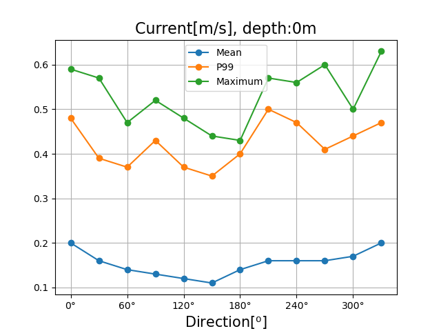

Current Speed Directional Return Periods Table
----------------------------------------------

.. code-block:: python

   tables.table_directional_return_periods(
       ds_ocean, 
       var='current_speed_0m', 
       periods=[1, 10, 100, 10000], 
       units='m/s', 
       var_dir='current_direction_0m', 
       distribution='Weibull3P_MOM', 
       adjustment='NORSOK', 
       output_file='directional_extremes_weibull_current_0m.csv'
   )

.. csv-table:: 
   :header-rows: 1
   :file: files/directional_extremes_weibull_current_0m.csv

Current Speed Monthly Return Periods Table
------------------------------------------

.. code-block:: python

   tables.table_monthly_return_periods(
       ds_ocean, 
       var='current_speed_0m', 
       periods=[1, 10, 100, 10000], 
       units='m/s', 
       distribution='Weibull3P_MOM', 
       method='POT', 
       threshold='P99', 
       output_file='monthly_extremes_weibull_current_0m.csv'
   )

.. csv-table:: 
   :header-rows: 1
   :file: files/monthly_extremes_weibull_current_0m.csv

Current Speed Profile Return Values Plot
----------------------------------------

.. code-block:: python

   plots.plot_profile_return_values(
       ds_ocean, 
       var=['current_speed_' + d for d in depth], 
       z=[float(d[:-1]) for d in depth], 
       periods=[1, 10, 100, 10000], 
       reverse_yaxis=True, 
       output_file='RVE_current_profile.png'
   )

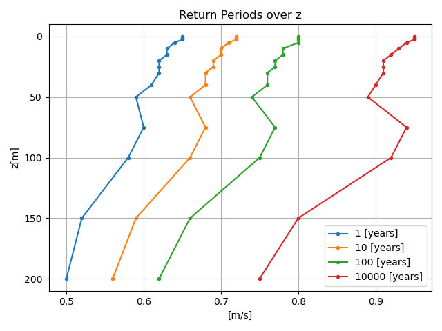

Current Speed for Given Wind Table
----------------------------------

.. code-block:: python

   tables.table_current_for_given_wind(
       ds_all, 
       var_curr='current_speed_0m', 
       var_wind='W10', 
       bin_width=2, 
       max_wind=42, 
       output_file='table_perc_current_for_wind.csv'
   )

.. csv-table:: 
   :header-rows: 1
   :file: files/table_perc_current_for_wind.csv

Current Speed for Given Wind Plot
---------------------------------

.. code-block:: python

   plots.plot_current_for_given_wind(
       ds_all, 
       var_curr='current_speed_0m', 
       var_wind='W10', 
       max_wind=40, 
       output_file='curr_for_given_wind.png'
   )

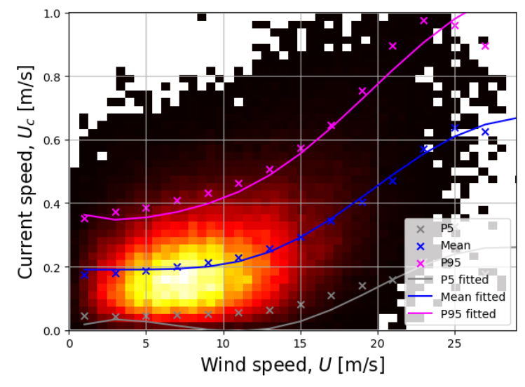

Current Speed for Given Hs Table
--------------------------------

.. code-block:: python

   tables.table_current_for_given_hs(
       ds_all, 
       var_curr='current_speed_0m', 
       var_hs='HS', 
       bin_width=2, 
       max_hs=20, 
       output_file='table_perc_current_for_Hs.csv'
   )

.. csv-table:: 
   :header-rows: 1
   :file: files/table_perc_current_for_Hs.csv

Current Speed for Given Wind Table
----------------------------------

.. code-block:: python

   tables.table_current_for_given_wind(
       df, 
       var_curr='current_speed_0m', 
       var_wind='W10', 
       bin_width=2, 
       max_wind=42, 
       output_file='table_perc_current_for_wind.csv'
   )

.. csv-table:: 
   :header-rows: 1
   :file: files/table_perc_current_for_wind.csv

Current Speed for Given Hs Table
--------------------------------

.. code-block:: python

   tables.table_current_for_given_hs(
       df, 
       var_curr='current_speed_0m', 
       var_hs='HS', 
       bin_width=2, 
       max_hs=20, 
       output_file='table_perc_current_for_Hs.csv'
   )

.. csv-table:: 
   :header-rows: 1
   :file: files/table_perc_current_for_Hs.csv

Current Speed for Given Hs Plot
-------------------------------

.. code-block:: python

   plots.plot_current_for_given_hs(
       ds_all, 
       var_curr='current_speed_0m', 
       var_hs='HS', 
       max_hs=20, 
       output_file='curr_for_given_hs.png'
   )

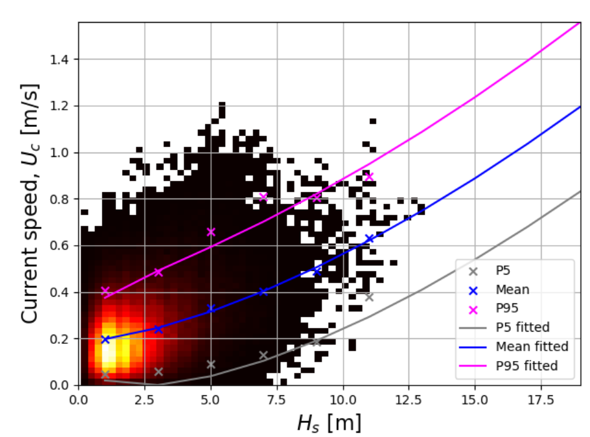

Extreme Current Profile Return Values Table
--------------------------------------------

.. code-block:: python

   tables.table_extreme_current_profile_rv(
       ds_ocean, 
       var=['current_speed_' + d for d in depth], 
       z=[float(d[:-1]) for d in depth], 
       periods=[1, 100, 1000], 
       percentile=95, 
       output_file='table_extreme_current_profile_rv.png'
   )

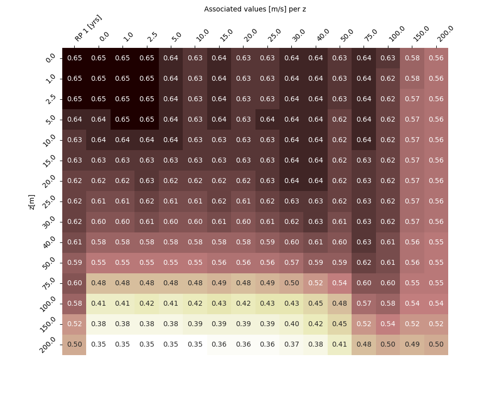

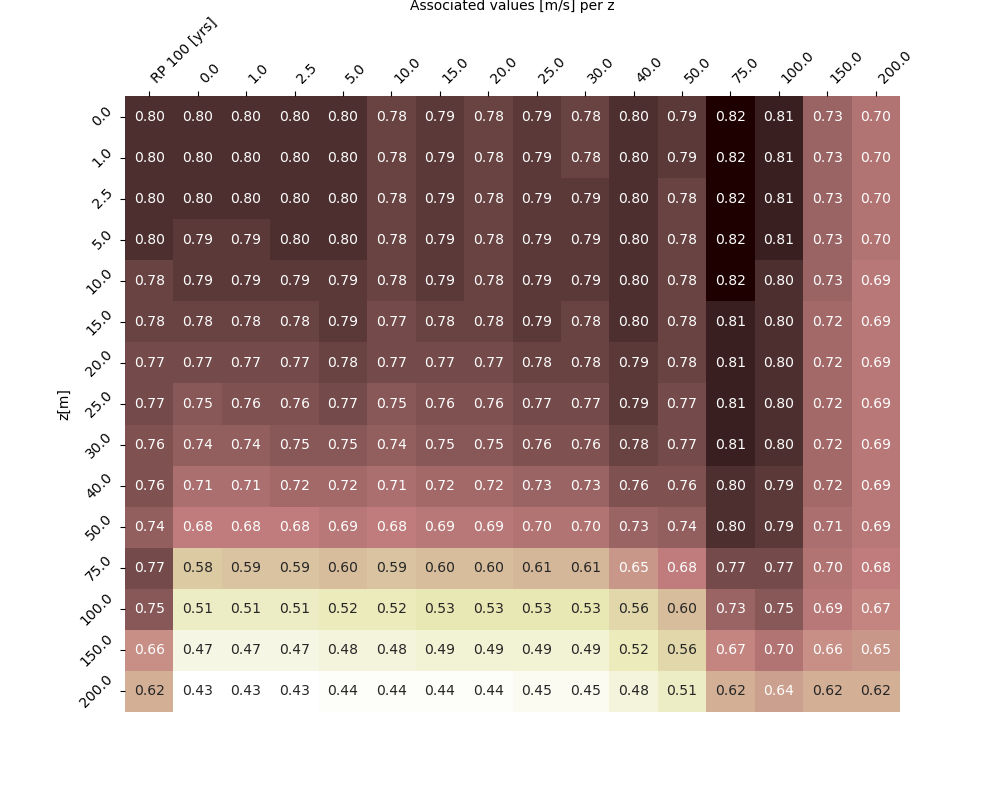

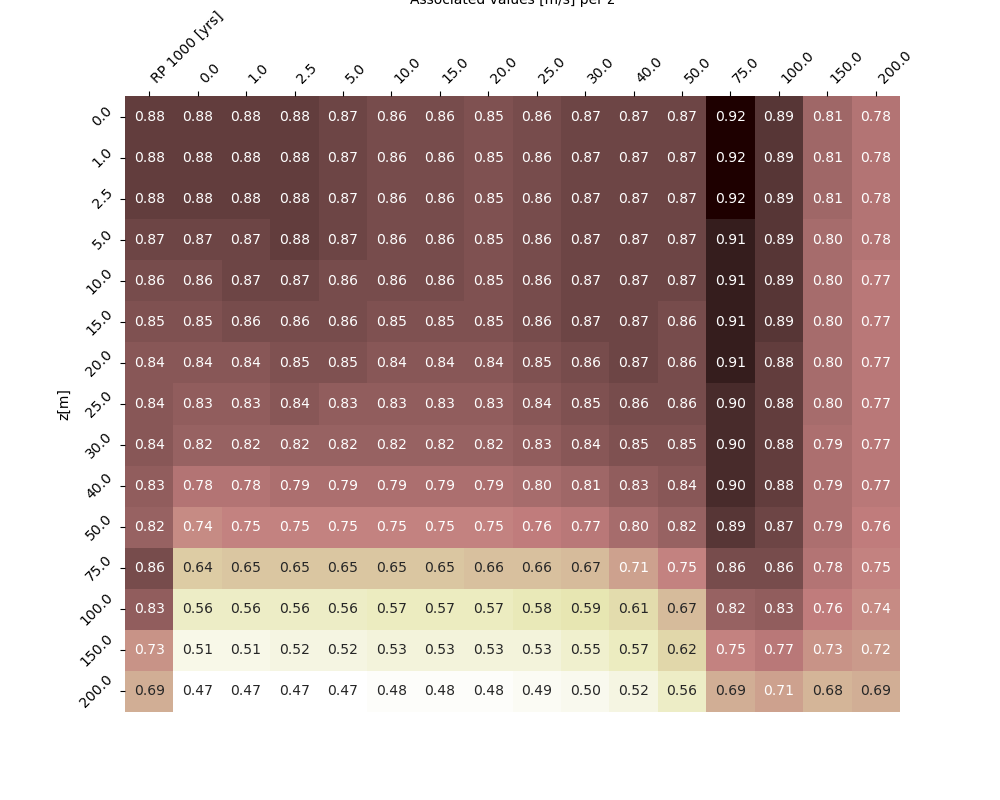

Profile Statistics Table
------------------------

.. code-block:: python

   tables.table_profile_stats(
       ds_ocean, 
       var=['current_speed_' + d for d in depth], 
       z=[float(d[:-1]) for d in depth], 
       var_dir=['current_direction_' + d for d in depth], 
       output_file='table_profile_stats.csv'
   )

.. csv-table:: 
   :header-rows: 1
   :file: files/table_profile_stats.csv

Profile Statistics Plot
------------------------

.. code-block:: python

   plots.plot_profile_stats(
       ds_ocean, 
       var=['current_speed_' + d for d in depth], 
       z=[float(d[:-1]) for d in depth], 
       reverse_yaxis=True, 
       output_file='stats_current_profile.png'
   )

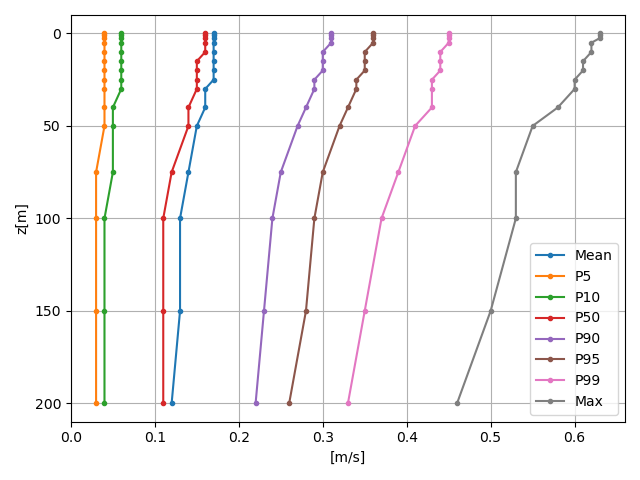

Current Speed for RV Wind Table
-------------------------------

.. code-block:: python

   tables.table_current_for_rv_wind(
       ds_all, 
       var_curr='current_speed_0m', 
       var_wind='W10', 
       periods=[1, 10, 100, 10000], 
       output_file='Uc_for_rv_wind.csv'
   )

.. csv-table:: 
   :header-rows: 1
   :file: files/Uc_for_rv_wind.csv

Current Speed for RV Hs Table
-----------------------------

.. code-block:: python

   tables.table_current_for_rv_hs(
       ds_all, 
       var_curr='current_speed_0m', 
       var_hs='HS', 
       periods=[1, 10, 100, 10000], 
       output_file='Uc_for_rv_hs.csv'
   )

.. csv-table:: 
   :header-rows: 1
   :file: files/Uc_for_rv_hs.csv

Sea Temperature Profile Monthly Stats Table (Mean)
---------------------------------------------------

.. code-block:: python

   tables.table_profile_monthly_stats(
       ds_ocean, 
       var=['temp_' + d for d in depth], 
       z=[float(d[:-1]) for d in depth], 
       method='mean', 
       output_file='table_mean_temp_profile_monthly_stats.png'
   )

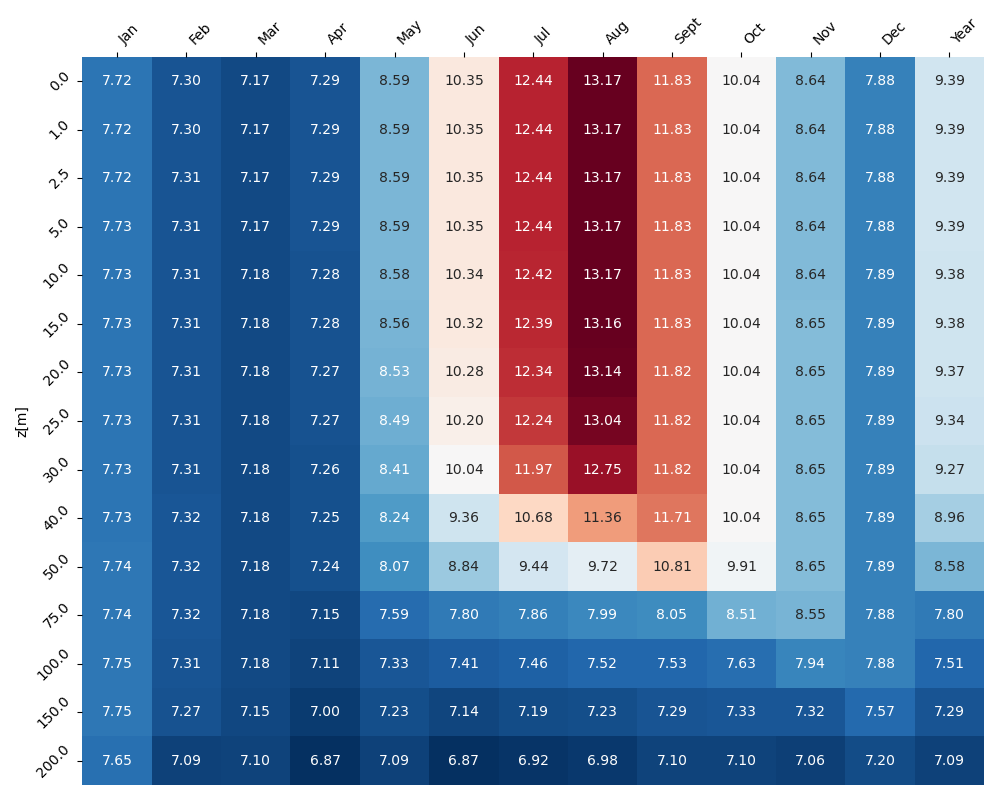

Sea Temperature Profile Monthly Stats Table (Standard Deviation)
----------------------------------------------------------------

.. code-block:: python

   tables.table_profile_monthly_stats(
       ds_ocean, 
       var=['temp_' + d for d in depth], 
       z=[float(d[:-1]) for d in depth], 
       method='std.dev', 
       output_file='table_std_temp_profile_monthly_stats.png'
   )

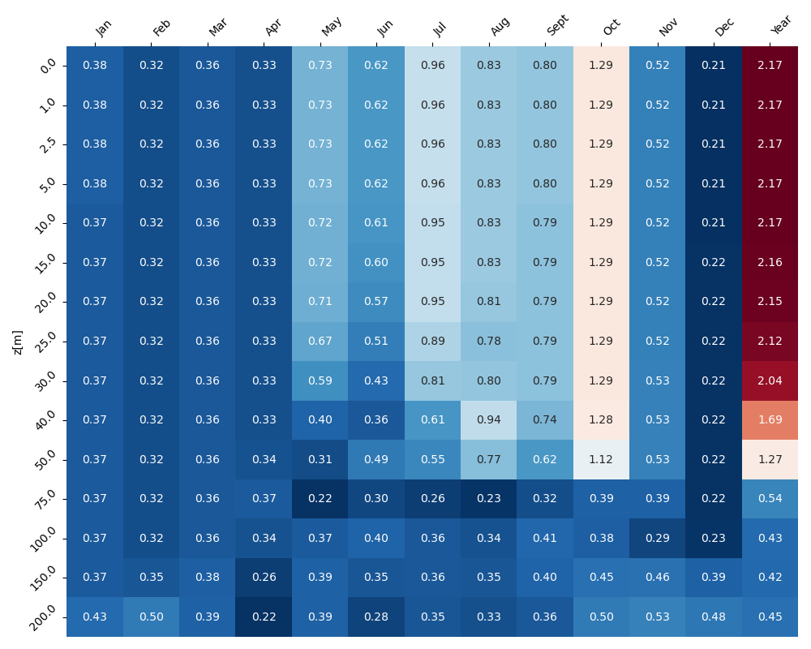

Sea Temperature Profile Monthly Stats Table (Minimum)
------------------------------------------------------

.. code-block:: python

   tables.table_profile_monthly_stats(
       ds_ocean, 
       var=['temp_' + d for d in depth], 
       z=[float(d[:-1]) for d in depth], 
       method='minimum', 
       output_file='table_min_temp_profile_monthly_stats.png'
   )

.. image:: files/table_min_temp_profile_monthly_stats.png
   :width: 500

Sea Temperature Profile Monthly Stats Table (Maximum)
------------------------------------------------------

.. code-block:: python

   tables.table_profile_monthly_stats(
       ds_ocean, 
       var=['temp_' + d for d in depth], 
       z=[float(d[:-1]) for d in depth], 
       method='maximum', 
       output_file='table_max_temp_profile_monthly_stats.png'
   )

.. image:: files/table_max_temp_profile_monthly_stats.png
   :width: 500

Mean Sea Temperature Profile Monthly Stats Plot
------------------------------------------------

.. code-block:: python

   plots.plot_profile_monthly_stats(
       ds_ocean, 
       var=['temp_' + d for d in depth], 
       z=[float(d[:-1]) for d in depth], 
       method='mean', 
       title='Mean Sea Temperature [°C]', 
       output_file='plot_mean_temp_profile_monthly_stats.png'
   )

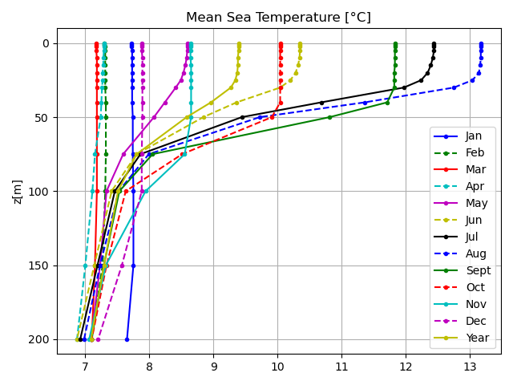

Sea Temperature Profile Monthly Stats Plot (Minimum)
-----------------------------------------------------

.. code-block:: python

   plots.plot_profile_monthly_stats(
       ds_ocean, 
       var=['temp_' + d for d in depth], 
       z=[float(d[:-1]) for d in depth], 
       method='minimum', 
       title='Min. Sea Temperature [°C]', 
       output_file='plot_min_temp_profile_monthly_stats.png'
   )

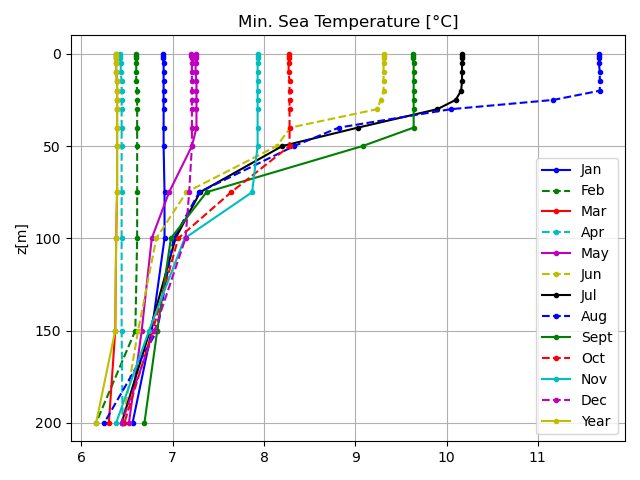

Sea Temperature Profile Monthly Stats Plot (Maximum)
-----------------------------------------------------

.. code-block:: python

   plots.plot_profile_monthly_stats(
       ds_ocean, 
       var=['temp_' + d for d in depth], 
       z=[float(d[:-1]) for d in depth], 
       method='maximum', 
       title='Max. Sea Temperature [°C]', 
       output_file='plot_max_temp_profile_monthly_stats.png'
   )

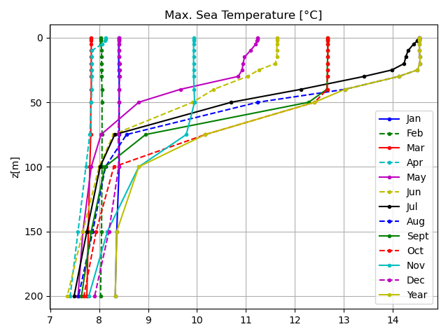

Mean Sea Temperature Profile Monthly Stats Plot
------------------------------------------------

.. code-block:: python

   plots.plot_profile_monthly_stats(
       ds_ocean, 
       var=['temp_' + d for d in depth], 
       z=[float(d[:-1]) for d in depth], 
       method='mean', 
       title='Mean Sea Temperature [°C]', 
       output_file='plot_mean_temp_profile_monthly_stats.png'
   )

Min. Sea Temperature Profile Monthly Stats Plot
------------------------------------------------

.. code-block:: python

   plots.plot_profile_monthly_stats(
       ds_ocean, 
       var=['temp_' + d for d in depth], 
       z=[float(d[:-1]) for d in depth], 
       method='minimum', 
       title='Min. Sea Temperature [°C]', 
       output_file='plot_min_temp_profile_monthly_stats.png'
   )

Max. Sea Temperature Profile Monthly Stats Plot
------------------------------------------------

.. code-block:: python

   plots.plot_profile_monthly_stats(
       ds_ocean, 
       var=['temp_' + d for d in depth], 
       z=[float(d[:-1]) for d in depth], 
       method='maximum', 
       title='Max. Sea Temperature [°C]', 
       output_file='plot_max_temp_profile_monthly_stats.png'
   )

Mean Salinity Profile Monthly Stats Table
------------------------------------------

.. code-block:: python

   tables.table_profile_monthly_stats(
       ds_ocean, 
       var=['salt_' + d for d in depth], 
       z=[float(d[:-1]) for d in depth], 
       method='mean', 
       output_file='table_mean_sal_profile_monthly_stats.png'
   )

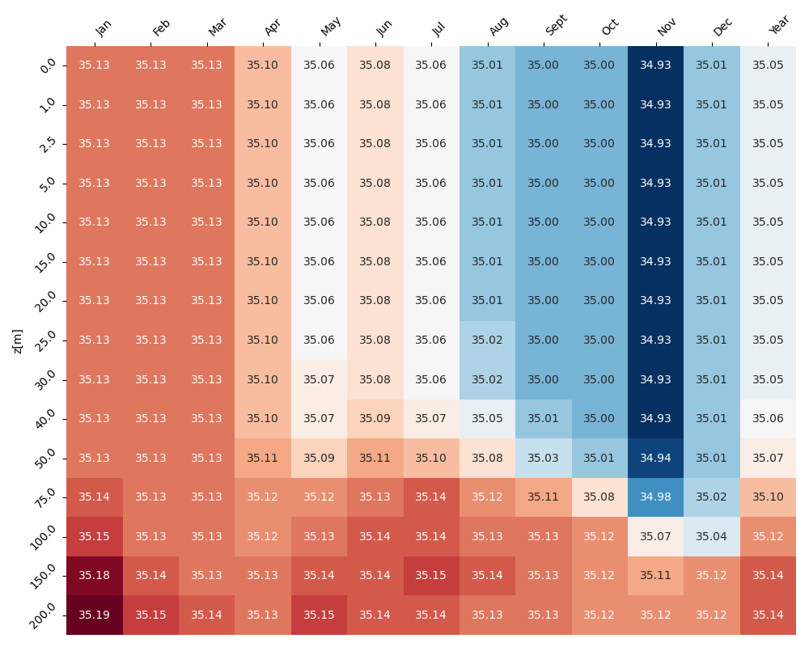

Standard Deviation Salinity Profile Monthly Stats Table
-------------------------------------------------------

.. code-block:: python

   tables.table_profile_monthly_stats(
       ds_ocean, 
       var=['salt_' + d for d in depth], 
       z=[float(d[:-1]) for d in depth], 
       method='std.dev', 
       output_file='table_std_sal_profile_monthly_stats.png'
   )

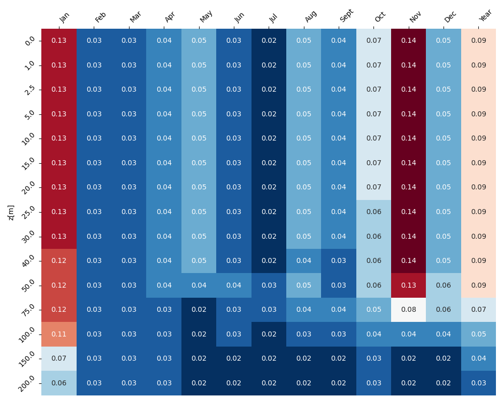

Min. Salinity Profile Monthly Stats Table
------------------------------------------

.. code-block:: python

   tables.table_profile_monthly_stats(
       ds_ocean, 
       var=['salt_' + d for d in depth], 
       z=[float(d[:-1]) for d in depth], 
       method='minimum', 
       output_file='table_min_sal_profile_monthly_stats.png'
   )

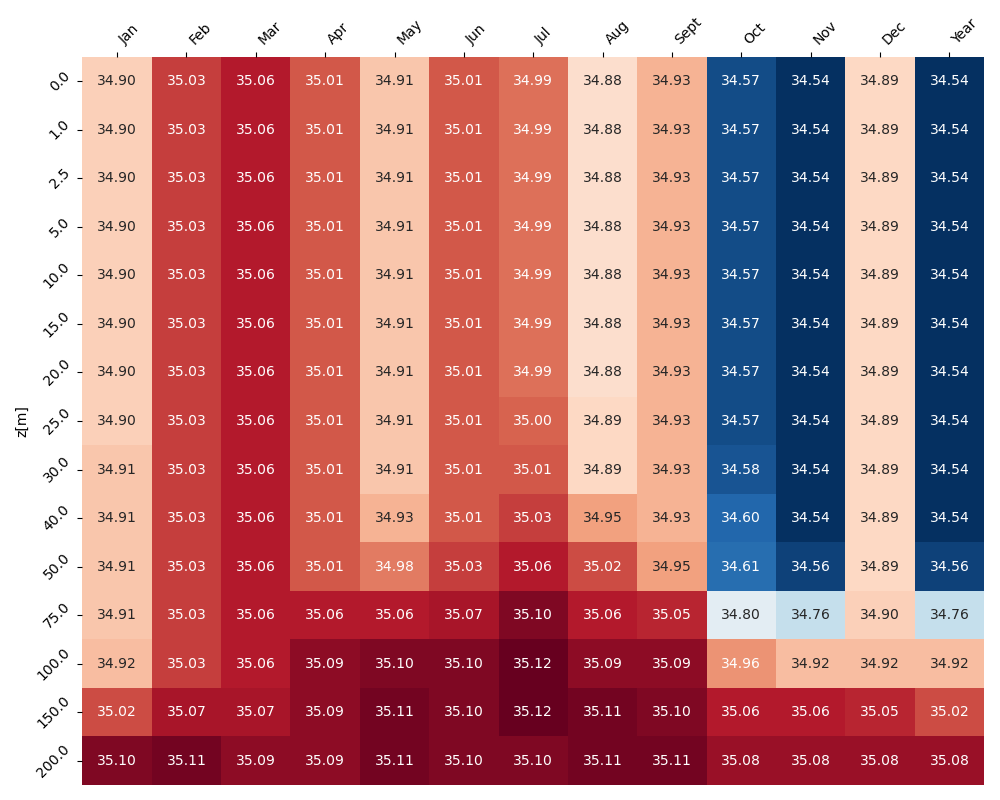

Max. Salinity Profile Monthly Stats Table
------------------------------------------

.. code-block:: python

   tables.table_profile_monthly_stats(
       ds_ocean, 
       var=['salt_' + d for d in depth], 
       z=[float(d[:-1]) for d in depth], 
       method='maximum', 
       output_file='table_max_sal_profile_monthly_stats.png'
   )

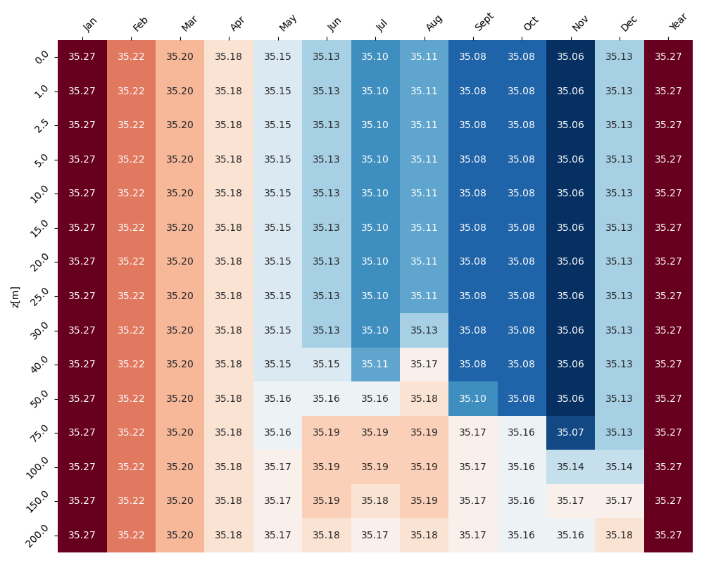

Mean Salinity Profile Monthly Stats Plot
-----------------------------------------

.. code-block:: python

   plots.plot_profile_monthly_stats(
       ds_ocean, 
       var=['salt_' + d for d in depth], 
       z=[float(d[:-1]) for d in depth], 
       method='mean', 
       title='Mean Salinity [PSU]', 
       output_file='plot_mean_sal_profile_monthly_stats.png'
   )

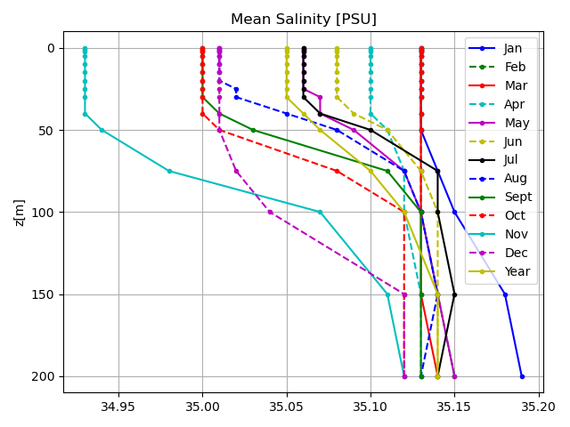

Standard Deviation Salinity Profile Monthly Stats Plot
-------------------------------------------------------

.. code-block:: python

   plots.plot_profile_monthly_stats(
       ds_ocean, 
       var=['salt_' + d for d in depth], 
       z=[float(d[:-1]) for d in depth], 
       method='std.dev', 
       title='St.Dev Salinity [PSU]', 
       output_file='plot_std_sal_profile_monthly_stats.png'
   )

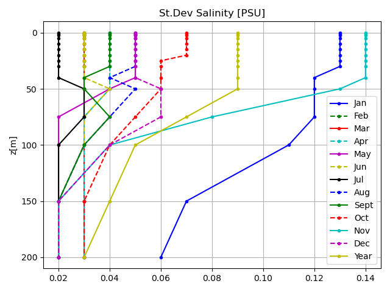

Min. Salinity Profile Monthly Stats Plot
-----------------------------------------

.. code-block:: python

   plots.plot_profile_monthly_stats(
       ds_ocean, 
       var=['salt_' + d for d in depth], 
       z=[float(d[:-1]) for d in depth], 
       method='minimum', 
       title='Min. Salinity [PSU]', 
       output_file='plot_min_sal_profile_monthly_stats.png'
   )

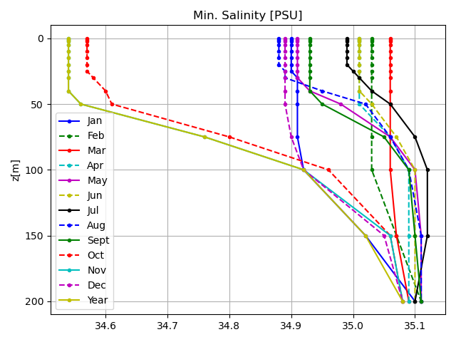

Max. Salinity Profile Monthly Stats Plot
-----------------------------------------

.. code-block:: python

   plots.plot_profile_monthly_stats(
       ds_ocean, 
       var=['salt_' + d for d in depth], 
       z=[float(d[:-1]) for d in depth], 
       method='maximum', 
       title='Max. Salinity [PSU]', 
       output_file='plot_max_sal_profile_monthly_stats.png'
   )

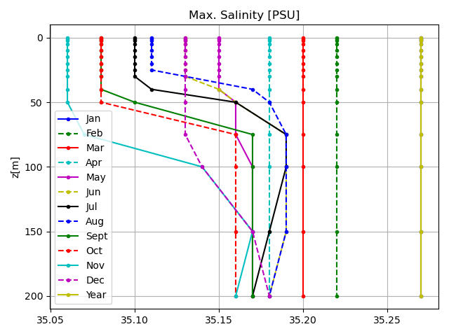

Tidal Levels Table
------------------

.. code-block:: python

   tables.table_tidal_levels(
       ds_tide, 
       var='tide', 
       output_file='tidal_levels.csv'
   )

.. csv-table::
   :header-rows: 1
   :file: files/tidal_levels.csv

Tidal Levels Plot
-----------------

.. code-block:: python

   plots.plot_tidal_levels(
       ds_all, 
       var='tide', 
       start_time='1980-01-01', 
       end_time='2014-12-31', 
       output_file='tidal_levels.png'
   )

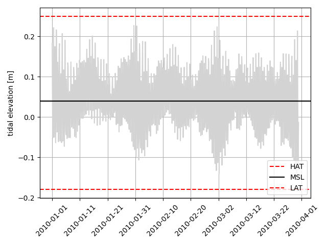

Storm Surge for Given Hs Table
------------------------------

.. code-block:: python

   tables.table_storm_surge_for_given_hs(
       ds_all, 
       var_surge='zeta_0m', 
       var_hs='HS', 
       bin_width=1, 
       max_hs=20, 
       output_file='table_perc_surge_for_Hs.csv'
   )

.. csv-table::
   :header-rows: 1
   :file: files/table_perc_surge_for_Hs.csv

Storm Surge for Given Hs Plot
-----------------------------

.. code-block:: python

   plots.plot_storm_surge_for_given_hs(
       ds_all,
       var_surge='zeta_0m', 
       var_hs='HS', 
       max_hs=20, 
       output_file='surge_for_given_hs.png'
   )

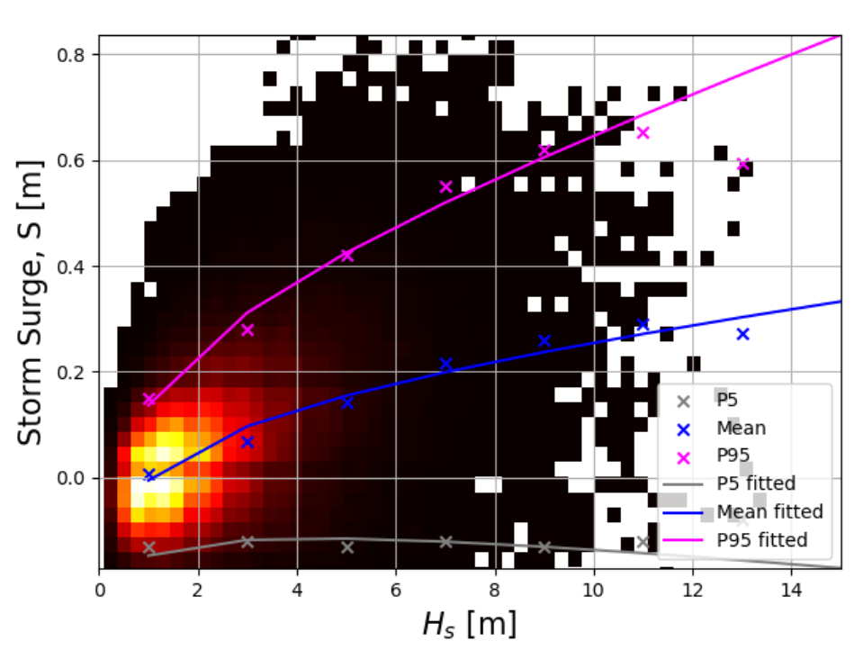

Extreme Total Water Level Table
-------------------------------

.. code-block:: python

   tables.table_extreme_total_water_level(
       ds_all, 
       var_hs='HS',
       var_tp='TP',
       var_surge='zeta_0m', 
       var_tide='tide', 
       periods=[100,10000], 
       output_file='table_extreme_total_water_level.csv'
   )

.. csv-table::
   :header-rows: 1
   :file: files/table_extreme_total_water_level.csv

Storm Surge for Return Values Hs Table
--------------------------------------

.. code-block:: python

   tables.table_storm_surge_for_rv_hs(
       ds_all, 
       var_hs='HS',
       var_tp='TP',
       var_surge='zeta_0m', 
       var_tide='tide', 
       periods=[1,10,100,10000],
       depth=200, 
       output_file='table_storm_surge_for_rv_hs.csv'
   )

.. csv-table::
   :header-rows: 1
   :file: files/table_storm_surge_for_rv_hs.csv

Map Statistics
==============

.. code-block:: python
   
   from metocean_stats import maps

Plot map with points of interest:

.. code-block:: python
   
   maps.plot_points_on_map(lon=[3.35,3.10], 
                      lat=[60.40,60.90],
                      label=['NORA3','NORKYST800'], 
                      bathymetry='NORA3')

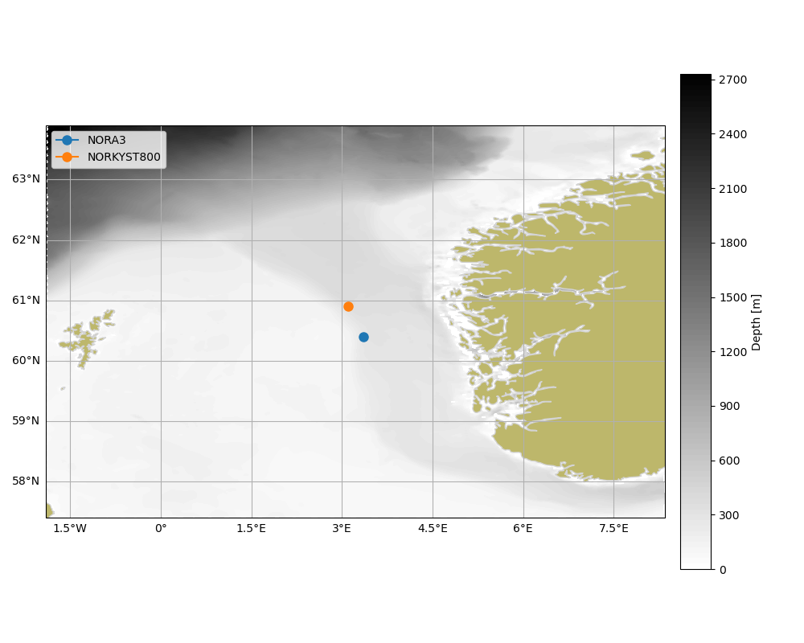

Plot extreme signigicant wave height based on NORA3 data:

.. code-block:: python

  maps.plot_extreme_wave_map(return_period=100, 
                         product='NORA3', 
                         title='100-yr return values Hs (NORA3)', 
                         set_extent = [0,30,52,73])

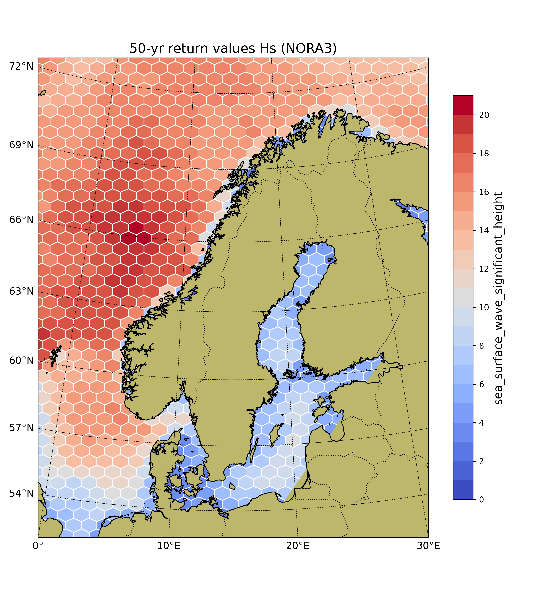

Plot extreme wind at 10 m height based on NORA3 data:

.. code-block:: python

   maps.plot_extreme_wind_map(return_period=100, 
                         product='NORA3',
                         z=10, 
                         title='100-yr return values Wind at 10 m (NORA3)', 
                         set_extent = [0,30,52,73])

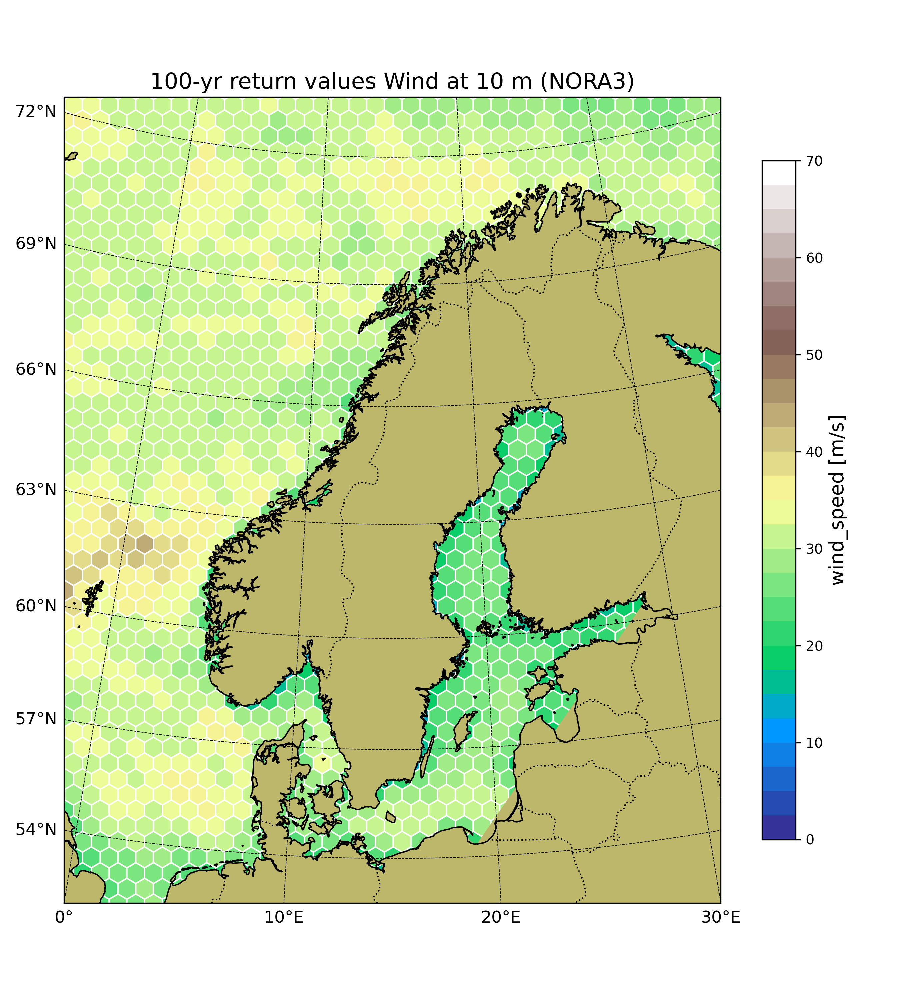

Plot extreme wind at 100 m height based on NORA3 data:

.. code-block:: python

   plot_extreme_wind_map(return_period=100, 
                         product='NORA3',
                         z=100, 
                         title='100-yr return values Wind at 100 m (NORA3)', 
                         set_extent = [0,30,52,73])

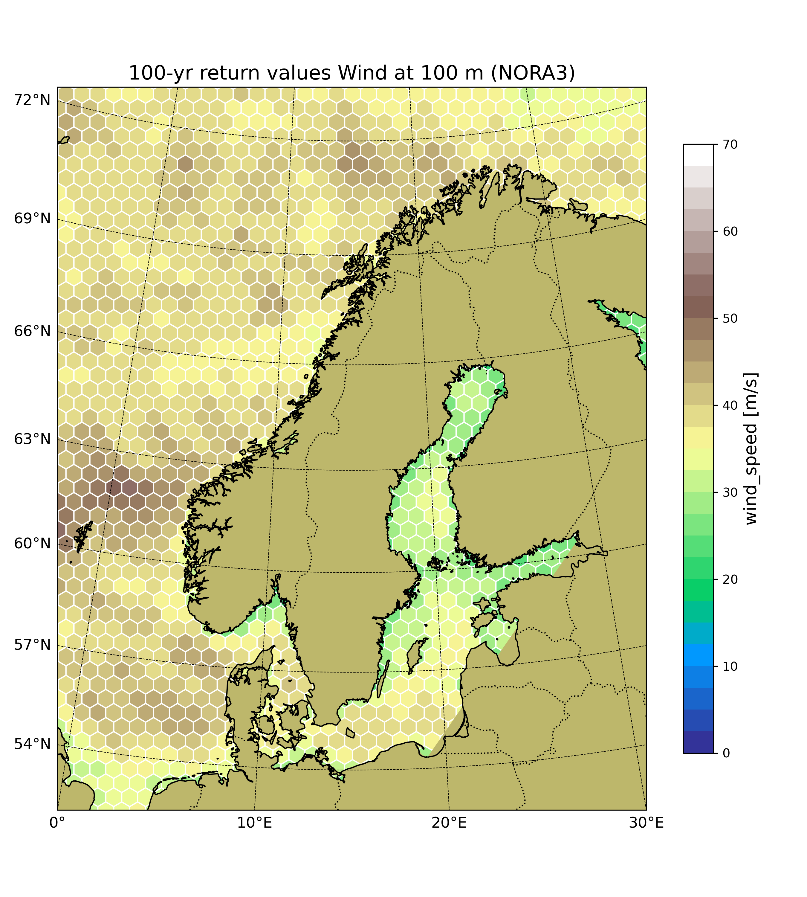

Plot mean 2-m air temperature based on NORA3 data:

.. code-block:: python

   plot_mean_air_temperature_map(product='NORA3', 
                                 title='Mean 2-m air temperature 1991-2020 (NORA3)', 
                                 set_extent=[-25,-10,60.5,68], 
                                 unit='degC')

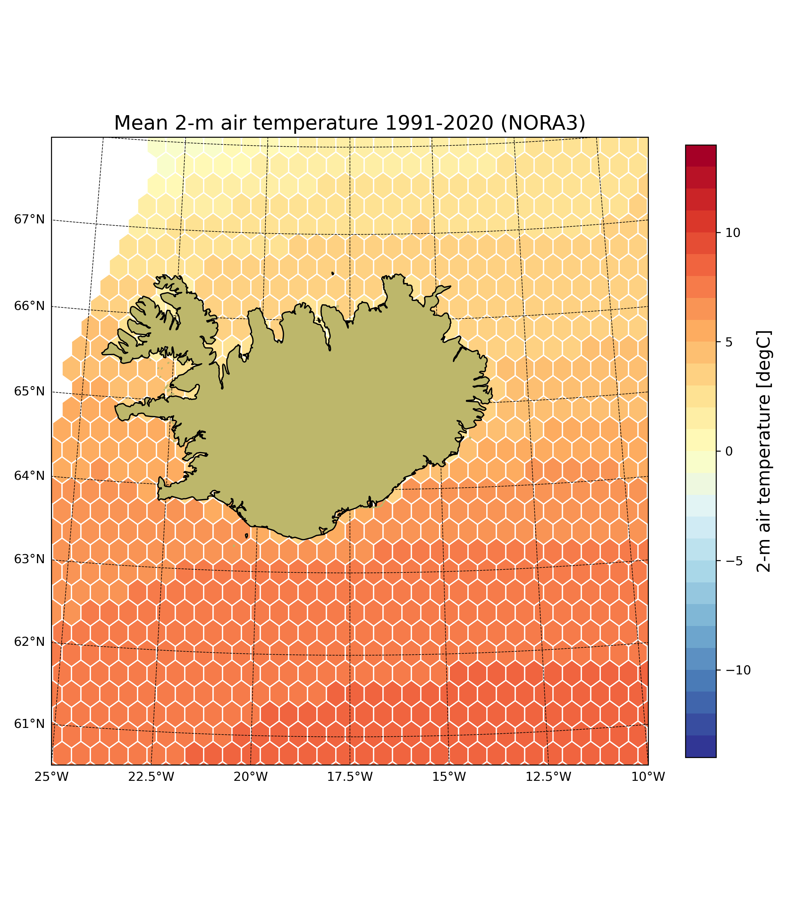

Auxiliary Functions
===================

.. code-block:: python

   from metocean_stats.stats.aux_funcs import *

Convert lat/lon coordinates from degrees/minutes/seconds to decimals:

.. code-block:: python

   lat = degminsec_to_decimals(60,30,00)
   
returns lat = 60.5

.. toctree::
   :maxdepth: 1