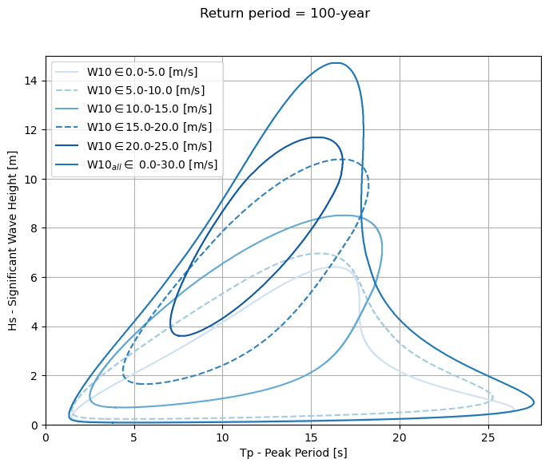
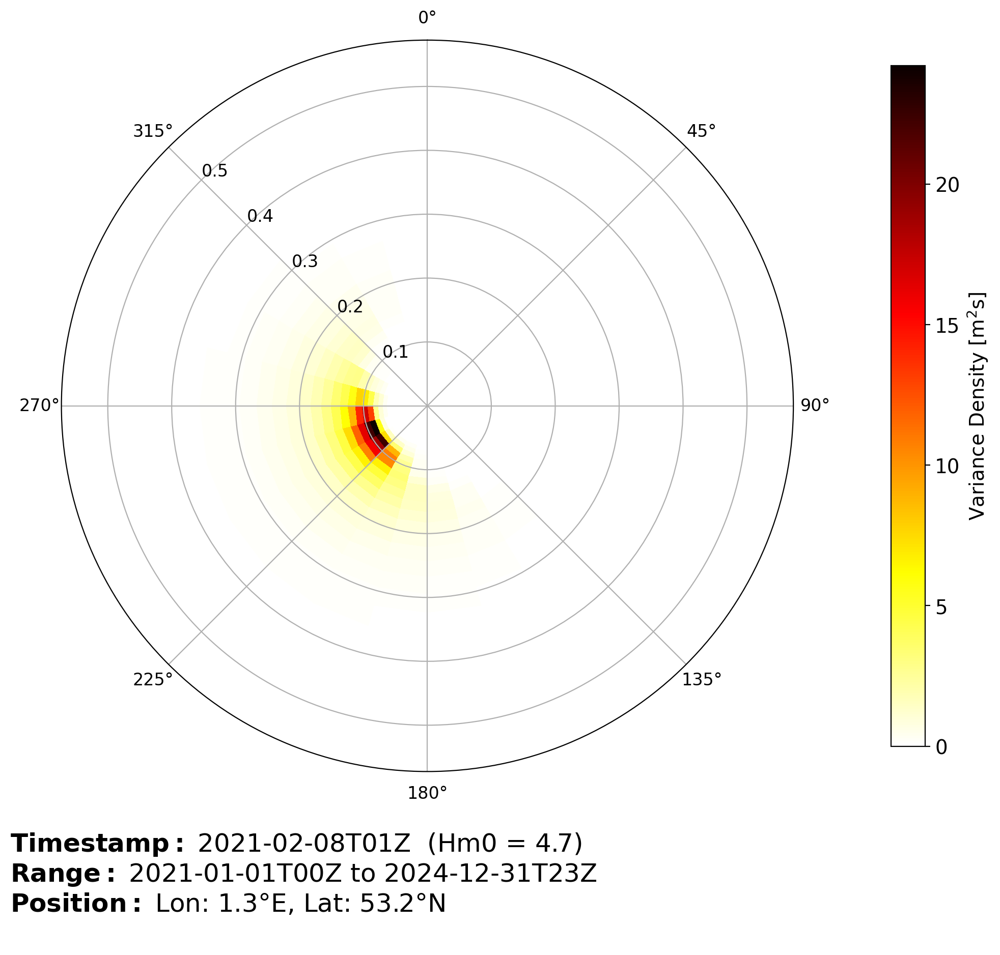
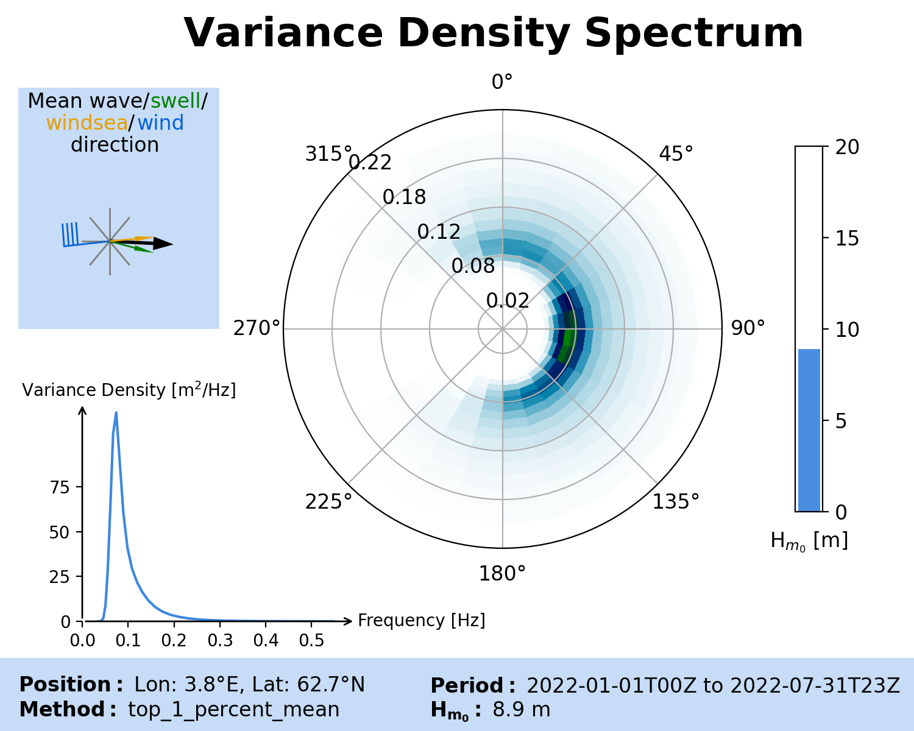

Welcome to metocean-stats's documentation!
==========================================

**metocean-stats** is a Python tool for comprehensive statistics and visualization of metocean data (wind, waves, ocean currents, tide levels, air and water temperature, sea ice, and more). The input data is conveniently provided within the tool as a Pandas DataFrame (time series of metocean variables) from a single position. 

The tool is designed with cross-platform compatibility in mind. It can smoothly operate on various operating systems, including Linux, Windows, and MacOS. It is also compatible with WEkEO Jupyter Lab, allowing seamless integration and use. For instructions on how to install metocean-stats in WEkEO, please refer `here <https://docs.google.com/document/d/1uEvG_YZ43eu3vE33Qv9t5Bzd0QAmspKjqjzFLHEkJys/edit?usp=sharing>`_

The tool contains functions that generate:
  * general (e.g., seasonal, annual) statistics,
  * extreme statistics, 
  * marine operation statistics.

Installing **metocean-stats**
=============================

Alternative 1: Using Mambaforge (alternative to Miniconda)
----------------------------------------------------------

1. Install `mambaforge <https://mamba.readthedocs.io/en/latest/installation.html>`_ (`download <https://github.com/conda-forge/miniforge#mambaforge>`_)
2. Set up a *Python 3* environment for metocean-stats and install metocean-stats

.. code-block:: bash

   $ mamba create -n metocean-stats python=3 metocean-stats
   $ conda activate metocean-stats

Alternative 2: Using Mambaforge (alternative to Miniconda) and Git
------------------------------------------------------------------

1. Install `mambaforge <https://mamba.readthedocs.io/en/latest/installation.html>`_ (`download <https://github.com/conda-forge/miniforge#mambaforge>`_)
2. Clone metocean-stats:

.. code-block:: bash

   $ git clone https://github.com/MET-OM/metocean-stats.git
   $ cd metocean-stats/

3. Create environment with the required dependencies and install metocean-stats

.. code-block:: bash

   $ mamba env create -f environment.yml
   $ conda activate metocean-stats
   $ pip install --no-deps -e .

This installs the metocean-stats as an editable package. Therefore, you can directly change the repository or fetch the newest changes with :code:`git pull`. 

To update the local conda environment in case new dependencies are added to environment.yml:

.. code-block:: bash

   $ mamba env update -f environment.yml

Metocean Statistics
===================

Import plots and tables from metocean-stats:

.. code-block:: python
   
   from metocean_stats import plots, tables

Scatter Diagram
---------------

.. code-block:: python
   
   tables.scatter_diagram(
       df, 
       var1='HS', 
       step_var1=1, 
       var2='TP', 
       step_var2=1, 
       output_file='Hs_Tp_scatter.csv'
   )

.. csv-table:: Scatter diagram
   :header-rows: 1
   :file: files/Hs_Tp_scatter.csv

.. code-block:: python
   
   tables.scatter_diagram(
       df, 
       var1='HS', 
       step_var1=1, 
       var2='TP', 
       step_var2=1, 
       output_file='Hs_Tp_scatter.png'
   )

.. image:: files/Hs_Tp_scatter.png
   :width: 500

Wind Profile Return Values Table
--------------------------------

.. code-block:: python

   tables.table_profile_return_values(
       df,
       var=['W10', 'W50', 'W80', 'W100', 'W150'],
       z=[10, 50 , 80, 100, 150],
       periods=[1, 10, 100, 10000],
       output_file='RVE_wind_profile.csv'
   )

.. csv-table:: 
   :header-rows: 1
   :file: files/RVE_wind_profile.csv

Wind Profile Return Values Plot
-------------------------------

.. code-block:: python

   plots.plot_profile_return_values(
       df,
       var=['W10', 'W50', 'W80', 'W100', 'W150'],
       z=[10, 50, 80, 100, 150],
       periods=[1, 10, 100, 10000],
       reverse_yaxis=False,
       title='Return Periods over z',
       units='m/s',
       distribution='Weibull3P',
       method='default',
       threshold='default',
       output_file='RVE_wind_profile.png'
   )

.. image:: files/RVE_wind_profile.png
   :width: 500

Wind Profile Statistics Plot
----------------------------

.. code-block:: python

   plots.plot_profile_stats(
       df,
       var=['W10', 'W50', 'W80', 'W100', 'W150'],
       z=[10, 50, 80, 100, 150],
       reverse_yaxis=False,
       output_file='wind_stats_profile.png'
   )

.. image:: files/wind_stats_profile.png
   :width: 500

Directional Wind Return Periods (NORSOK Adjustment)
---------------------------------------------------

.. code-block:: python

   plots.plot_directional_return_periods(
       df,
       var='W10',
       var_dir='D10',
       periods=[1, 10, 100, 1000],
       distribution='Weibull3P_MOM',
       adjustment='NORSOK',
       units='m/s',
       output_file='Wind.dir_extremes_weibull_norsok.png'
   )

.. image:: files/Wind.dir_extremes_weibull_norsok.png
   :width: 500

Directional Wind Return Periods (No Adjustment)
-----------------------------------------------

.. code-block:: python

   plots.plot_directional_return_periods(
       df,
       var='W10',
       var_dir='D10',
       periods=[1, 10, 100, 1000],
       distribution='Weibull3P_MOM',
       adjustment=None,
       units='m/s',
       output_file='Wind.dir_extremes_weibull.png'
   )

.. image:: files/Wind.dir_extremes_weibull.png
   :width: 500

Monthly Non-Exceedance Table
----------------------------

.. code-block:: python

   tables.table_monthly_non_exceedance(
       df, 
       var='HS', 
       step_var=0.5, 
       output_file='Hs_table_monthly_non_exceedance.csv'
   )

.. csv-table:: 
   :header-rows: 1
   :file: files/Hs_table_monthly_non_exceedance.csv

Monthly Statistics Plot
------------------------

.. code-block:: python

   plots.plot_monthly_stats(
       df, 
       var='HS', 
       show=['Maximum','P99','Mean'], 
       title='Hs[m]', 
       output_file='Hs_monthly_stats.png'
   )

.. image:: files/Hs_monthly_stats.png
   :width: 500

Directional Non-Exceedance Table
--------------------------------

.. code-block:: python

   tables.table_directional_non_exceedance(
       df, 
       var='HS', 
       step_var=0.5, 
       var_dir='DIRM', 
       output_file='table_directional_non_exceedance.csv'
   )

.. csv-table:: 
   :header-rows: 1
   :file: files/table_directional_non_exceedance.csv

Directional Statistics Plot
----------------------------

.. code-block:: python

   plots.plot_directional_stats(
       df, 
       var='HS', 
       step_var=0.5, 
       var_dir='DIRM', 
       title='$H_s$[m]', 
       output_file='directional_stats.png'
   )

.. image:: files/directional_stats.png
   :width: 500

Prob. of Non-Exceedance (fitted)
--------------------------------

.. code-block:: python
   
   plots.plot_prob_non_exceedance_fitted_3p_weibull(df,
                                                    var='HS',
                                                    output_file='prob_non_exceedance_fitted_3p_weibull.png')

.. image:: files/prob_non_exceedance_fitted_3p_weibull.png
  :width: 700  

Joint Distribution Hs-Tp Plot
------------------------------

.. code-block:: python

   plots.plot_joint_distribution_Hs_Tp(
       df, 
       var_hs='HS', 
       var_tp='TP', 
       periods=[1,10,100,1000], 
       title='Hs-Tp joint distribution', 
       output_file='Hs.Tp.joint.distribution.png', 
       density_plot=True
   )

.. image:: files/Hs.Tp.joint.distribution.png
   :width: 500

Joint 2D distribution contours
------------------------------

.. code-block:: python

   plots.plot_joint_2D_contour(
       df, 
       var1='HS', 
       var2='TP', 
       return_periods=[1,10,100,1000], 
   )

Joint 3D distribution contour
------------------------------

.. code-block:: python

   plots.plot_joint_3D_contour(
       df, 
       var1 = 'W10',
       var2 = 'HS', 
       var3 = 'TP', 
       return_period=100
   )

Joint 3D distribution contour cross-sections
------------------------------

.. code-block:: python

   plots.plot_joint_3D_contour_slices(
      df,
      var1 = 'W10',
      var2 = 'HS',
      var3 = 'TP',
      slice_values = [5,10,15,20,25]
   )

Monthly Joint Distribution Hs-Tp Parameter Table
------------------------------------------------

.. code-block:: python

   tables.table_monthly_joint_distribution_Hs_Tp_param(
       df, 
       var_hs='HS', 
       var_tp='TP', 
       periods=[1,10,100,10000], 
       output_file='monthly_Hs_Tp_joint_param.csv'
   )

.. csv-table:: 
   :header-rows: 1
   :file: files/monthly_Hs_Tp_joint_param.csv

Directional Joint Distribution Hs-Tp Parameter Table
----------------------------------------------------

.. code-block:: python

   tables.table_directional_joint_distribution_Hs_Tp_param(
       df, 
       var_hs='HS', 
       var_tp='TP', 
       var_dir='DIRM', 
       periods=[1,10,100], 
       output_file='dir_Hs_Tp_joint_param.csv'
   )

.. csv-table:: 
   :header-rows: 1
   :file: files/dir_Hs_Tp_joint_param.csv

Joint Distribution Hs-Tp Multi Plot with binned Var3
------------------------------

.. code-block:: python

   plots.plots.plot_multi_joint_distribution_Hs_Tp_var3(
      df,
      var_hs='HS',
      var_tp='TP',
      var3='W10',
      var3_units='m/s',
      periods=[100],
      var3_bin=5,
      threshold_min=100,
      output_file='Hs.Tp.joint.distribution.multi.binned.var3.png'
      )

Monthly Weather Window Multiple Variables Plot (Waiting time in Days)
----------------------------------------------

.. code-block:: python

   plots.plot_monthly_weather_window(
       df, 
       var=['W10','HS','TP'], 
       threshold=[12.35,2,8], 
       window_size=62,
       timestep=3,
       add_table=True,
       output_file='NORA10_monthly_weather_window_mv_plot.png'
   )

Number Of Hours Per Year Below A Threshold Plot
---------------------------

.. code-block:: python

   plots.plot_nb_hours_below_threshold(
       df, 
       var='HS', 
       thr_arr=(np.arange(0.05,20.05,0.05)).tolist(),
       output_file='number_hours_per_year.png'
   )

.. image:: files/nb_hour_below_thr.png
   :width: 500

Number Of Hours Per Year Below A Threshold Table
---------------------------

.. code-block:: python

   tables.table_nb_hours_below_threshold(
       df,
       var='HS', 
       threshold=[1,2,3,4,5,6,7,8,9,10],
       output_file='number_hours_per_year.csv'
   )

.. csv-table:: 
   :header-rows: 1
   :file: files/nb_hour_below_thr.csv

All-Year Round Weather Window For Hs Under A Threshold Table
---------------------------

.. code-block:: python

   tables.table_weather_window_thresholds(
       df,
       var='HS', 
       threshold=[0.5,1,2],
       op_duration=[6,12,24,48],
       output_file='weather_window_thresholds.csv'
   )

.. csv-table:: 
   :header-rows: 1
   :file: files/weather_window_thresholds.csv

Monthly Return Periods Table
----------------------------

.. code-block:: python

   tables.table_monthly_return_periods(
       df, 
       var='HS', 
       periods=[1, 10, 100, 10000], 
       distribution='Weibull3P_MOM', 
       units='m', 
       output_file='HS_monthly_extremes_Weibull.csv'
   )

.. csv-table:: 
   :header-rows: 1
   :file: files/HS_monthly_extremes_Weibull.csv

Directional Return Periods Table
--------------------------------

.. code-block:: python

   tables.table_directional_return_periods(
       df, 
       var='HS', 
       periods=[1, 10, 100, 10000], 
       units='m', 
       var_dir='DIRM', 
       distribution='Weibull3P_MOM', 
       adjustment='NORSOK', 
       output_file='directional_extremes_weibull.csv'
   )

.. csv-table:: 
   :header-rows: 1
   :file: files/directional_extremes_weibull.csv

Monthly Return Periods Plot
---------------------------

.. code-block:: python

   plots.plot_monthly_return_periods(
       df, 
       var='HS', 
       periods=[1, 10, 100], 
       distribution='Weibull3P_MOM', 
       units='m', 
       output_file='HS_monthly_extremes.png'
   )

.. image:: files/HS_monthly_extremes.png
   :width: 500

Directional Return Periods Plot (GUM)
-------------------------------------

.. code-block:: python

   plots.plot_directional_return_periods(
       df, 
       var='HS', 
       var_dir='DIRM', 
       periods=[1, 10, 100, 10000], 
       distribution='GUM', 
       units='m', 
       output_file='dir_extremes_GUM.png'
   )

.. image:: files/dir_extremes_GUM.png
   :width: 500

Directional Return Periods Plot (Weibull)
-----------------------------------------

.. code-block:: python

   plots.plot_directional_return_periods(
       df, 
       var='HS', 
       var_dir='DIRM', 
       periods=[1, 10, 100, 10000], 
       distribution='Weibull3P_MOM', 
       units='m', 
       adjustment='NORSOK', 
       output_file='dir_extremes_Weibull_norsok.png'
   )

.. image:: files/dir_extremes_Weibull_norsok.png
   :width: 500

Monthly Joint Distribution Hs-Tp Return Values Table
----------------------------------------------------

.. code-block:: python

   tables.table_monthly_joint_distribution_Hs_Tp_return_values(
       df, 
       var_hs='HS', 
       var_tp='TP', 
       periods=[1,10,100,10000], 
       model='lonowe' # change to 'hs_tp' for DNV model
       output_file='monthly_Hs_Tp_joint_return_values.csv'
   )

.. csv-table:: 
   :header-rows: 1
   :file: files/monthly_Hs_Tp_joint_return_values.csv

Directional Joint Distribution Hs-Tp Return Values Table
--------------------------------------------------------

.. code-block:: python

   tables.table_directional_joint_distribution_Hs_Tp_return_values(
       df, 
       var_hs='HS', 
       var_tp='TP', 
       var_dir='DIRM', 
       periods=[1,10,100,1000], 
       adjustment='NORSOK', 
       model='lonowe' # change to 'hs_tp' for DNV model
       output_file='directional_Hs_Tp_joint_return_values.csv'
   )

.. csv-table:: 
   :header-rows: 1
   :file: files/directional_Hs_Tp_joint_return_values.csv

Hs-Tp Return Values Table
-------------------------

.. code-block:: python

   tables.table_Hs_Tpl_Tph_return_values(
       df, 
       var_hs='HS', 
       var_tp='TP', 
       periods=[1,10,100,10000], 
       output_file='hs_tpl_tph_return_values.csv'
   )

.. csv-table:: 
   :header-rows: 1
   :file: files/hs_tpl_tph_return_values.csv

Tp for Given Hs Plot
--------------------

.. code-block:: python

   plots.plot_tp_for_given_hs(
       df, 
       var_hs='HS', 
       var_tp='TP', 
       output_file='tp_for_given_hs.png'
   )

.. image:: files/tp_for_given_hs.png
   :width: 500

Tp for Given Hs Table
---------------------

.. code-block:: python

   tables.table_tp_for_given_hs(
       df, 
       var_hs='HS', 
       var_tp='TP', 
       max_hs=20, 
       output_file='tp_for_given_hs.csv'
   )

.. csv-table:: 
   :header-rows: 1
   :file: files/tp_for_given_hs.csv

Tp for RV Hs Table
------------------

.. code-block:: python

   tables.table_tp_for_rv_hs(
       df, 
       var_hs='HS', 
       var_tp='TP', 
       periods=[1,10,100,10000], 
       output_file='tp_for_rv_hs.csv'
   )

.. csv-table:: 
   :header-rows: 1
   :file: files/tp_for_rv_hs.csv

Wave-Induced Current (JONSWAP) Table
------------------------------------

.. code-block:: python

   tables.table_wave_induced_current(
       df, 
       var_hs='HS', 
       var_tp='TP', 
       depth=200, 
       ref_depth=200, 
       spectrum='JONSWAP', 
       output_file='JONSWAP_wave_induced_current_depth200.csv'
   )

.. csv-table:: 
   :header-rows: 1
   :file: files/JONSWAP_wave_induced_current_depth200.csv

Wave-Induced Current (TORSEHAUGEN) Table
----------------------------------------

.. code-block:: python

   tables.table_wave_induced_current(
       df, 
       var_hs='HS', 
       var_tp='TP', 
       depth=200, 
       ref_depth=200, 
       spectrum='TORSEHAUGEN', 
       output_file='TORSEHAUGEN_wave_induced_current_depth200.csv'
   )

.. csv-table:: 
   :header-rows: 1
   :file: files/TORSEHAUGEN_wave_induced_current_depth200.csv

Hs for Given Wind Table
-----------------------

.. code-block:: python

   tables.table_hs_for_given_wind(
       df, 
       var_hs='HS', 
       var_wind='W10', 
       bin_width=2, 
       max_wind=42, 
       output_file='table_perc_hs_for_wind.csv'
   )

.. csv-table:: 
   :header-rows: 1
   :file: files/table_perc_hs_for_wind.csv

Hs for Given Wind Plot
----------------------

.. code-block:: python

   plots.plot_hs_for_given_wind(
       df, 
       var_hs='HS', 
       var_wind='W10', 
       output_file='hs_for_given_wind.png'
   )

.. image:: files/hs_for_given_wind.png
   :width: 500

Hs for RV Wind Table
--------------------

.. code-block:: python

   tables.table_hs_for_rv_wind(
       df, 
       var_wind='W10', 
       var_hs='HS', 
       periods=[1,10,100,10000], 
       output_file='hs_for_rv_wind.csv'
   )

.. csv-table:: 
   :header-rows: 1
   :file: files/hs_for_rv_wind.csv

Hmax Return Values Table
------------------------

.. code-block:: python

   tables.table_Hmax_crest_return_periods(
       df, 
       var_hs='HS', 
       var_tp='TP', 
       depth=200, 
       periods=[1, 10, 100, 10000], 
       sea_state='long-crested'
   )

Directional Hmax Return Values Table
------------------------------------

.. code-block:: python

   tables.table_directional_Hmax_return_periods(
       df, 
       var_hs='HS', 
       var_tp='TP', 
       var_dir='DIRM', 
       periods=[10, 100, 10000], 
       adjustment='NORSOK', 
       output_file='table_dir_Hmax_return_values.csv'
   )

.. csv-table:: 
   :header-rows: 1
   :file: files/table_dir_Hmax_return_values.csv

T2m Monthly Return Periods Plot (Negative)
------------------------------------------

.. code-block:: python

   plots.plot_monthly_return_periods(
       df, 
       var='T2m', 
       periods=[1, 10, 100], 
       distribution='GUM_L', 
       method='minimum', 
       units='°C', 
       output_file='T2m_monthly_extremes_neg.png'
   )

.. image:: files/T2m_monthly_extremes_neg.png
   :width: 500

T2m Monthly Return Periods Table (Negative)
-------------------------------------------

.. code-block:: python

   tables.table_monthly_return_periods(
       df, 
       var='T2m', 
       periods=[1, 10, 100], 
       distribution='GUM_L', 
       method='minimum', 
       units='°C', 
       output_file='T2m_monthly_extremes_neg.csv'
   )

.. csv-table:: 
   :header-rows: 1
   :file: files/T2m_monthly_extremes_neg.csv

T2m Monthly Return Periods Plot (Positive)
------------------------------------------

.. code-block:: python

   plots.plot_monthly_return_periods(
       df, 
       var='T2m', 
       periods=[1, 10, 100], 
       distribution='GUM', 
       method='maximum', 
       units='°C', 
       output_file='T2m_monthly_extremes_pos.png'
   )

.. image:: files/T2m_monthly_extremes_pos.png
   :width: 500

T2m Monthly Return Periods Table (Positive)
-------------------------------------------

.. code-block:: python

   tables.table_monthly_return_periods(
       df, 
       var='T2m', 
       periods=[1, 10, 100], 
       distribution='GUM', 
       method='maximum', 
       units='°C', 
       output_file='T2m_monthly_extremes_pos.csv'
   )

.. csv-table:: 
   :header-rows: 1
   :file: files/T2m_monthly_extremes_pos.csv

T2m Monthly Statistics Plot
---------------------------

.. code-block:: python

   plots.plot_monthly_stats(
       df, 
       var='T2m', 
       show=['Minimum','Mean','Maximum'], 
       title='T2m', 
       output_file='T2m_monthly_stats.png'
   )

.. image:: files/T2m_monthly_stats.png
   :width: 500

T2m Monthly Non-Exceedance Table
--------------------------------

.. code-block:: python

   tables.table_monthly_non_exceedance(
       df, 
       var='T2m', 
       step_var=0.5, 
       output_file='T2m_table_monthly_non_exceedance.csv'
   )

Current Speed Monthly Return Periods Plot
-----------------------------------------

.. code-block:: python

   plots.plot_monthly_return_periods(
       df, 
       var='current_speed_0m', 
       periods=[1, 10, 100], 
       distribution='Weibull3P_MOM', 
       method='POT', 
       threshold='P99', 
       units='m/s', 
       output_file='csp0m_monthly_extremes.png'
   )

.. image:: files/csp0m_monthly_extremes.png
   :width: 500

Current Speed Monthly Rose Plot
-------------------------------

.. code-block:: python

   plots.var_rose(
       df, 
       'current_direction_0m', 
       'current_speed_0m', 
       max_perc=30, 
       decimal_places=2, 
       units='m/s', 
       method='monthly', 
       output_file='monthly_rose.png'
   )

.. image:: files/monthly_rose.png
   :width: 500

Current Speed Overall Rose Plot
-------------------------------

.. code-block:: python

   plots.var_rose(
       df, 
       'current_direction_0m', 
       'current_speed_0m', 
       max_perc=30, 
       decimal_places=2, 
       units='m/s', 
       method='overall', 
       output_file='overall_rose.png'
   )

.. image:: files/overall_rose.png
   :width: 500

Current Speed Monthly Statistics Plot
-------------------------------------

.. code-block:: python

   plots.plot_monthly_stats(
       df, 
       var='current_speed_0m', 
       show=['Mean', 'P99', 'Maximum'], 
       title='Current[m/s], depth:0m', 
       output_file='current_0m_monthly_stats.png'
   )

.. image:: files/current_0m_monthly_stats.png
   :width: 500

Hs Monthly Statistics with shaded band
-------------------------------------

.. code-block:: python

   plots.plot_monthly_stats(
      ds, 
      var="HS", 
      show=["10%", "mean", "90%"], 
      fill_between=["25%", "75%"], 
      fill_color_like="mean",
      output_file="")
    

Hs Daily Statistics with shaded band
-------------------------------------

.. code-block:: python

   plots.plot_daily_stats(
      ds, 
      var="HS", 
      show=["5%", "mean", "95%"], 
      fill_between=["25%", "75%"], 
      fill_color_like="mean")
    

Hs Hourly Statistics with shaded band
-------------------------------------

.. code-block:: python

   plots.plot_hourly_stats(
      ds, 
      var="HS", 
      show=["5%", "mean", "95%"], 
      fill_between=["25%", "75%"], 
      fill_color_like="mean",
      title="HS[m]")
    

Hs Daily percentile table
-------------------------------------

.. code-block:: python

   tables.table_daily_percentile(
      ds, 
      var="HS", 
      percentiles=["5%", "10%", "15%", "20%","mean", "99%", "max"], 
      divide_months=True)

Current Speed Directional Monthly Statistics
--------------------------------------------

.. code-block:: python

   tables.monthly_directional_percentiles(
        data=ds, 
        var="W10", 
        var_dir="D10", 
        percentiles=["5%", "25%", "mean", "75%", "99%", "max"], 
        nsectors=16,
        compass_point_names=True)

Current Speed Directional Statistics Plot
-----------------------------------------

.. code-block:: python

   plots.plot_directional_stats(
       df, 
       var='current_speed_0m', 
       var_dir='current_direction_0m', 
       step_var=0.05, 
       show=['Mean', 'P99', 'Maximum'], 
       title='Current[m/s], depth:0m', 
       output_file='current_0m_dir_stats.png'
   )

.. image:: files/current_0m_dir_stats.png
   :width: 500

Current Speed Directional Return Periods Table
----------------------------------------------

.. code-block:: python

   tables.table_directional_return_periods(
       df, 
       var='current_speed_0m', 
       periods=[1, 10, 100, 10000], 
       units='m/s', 
       var_dir='current_direction_0m', 
       distribution='Weibull3P_MOM', 
       adjustment='NORSOK', 
       output_file='directional_extremes_weibull_current_0m.csv'
   )

.. csv-table:: 
   :header-rows: 1
   :file: files/directional_extremes_weibull_current_0m.csv

Current Speed Monthly Return Periods Table
------------------------------------------

.. code-block:: python

   tables.table_monthly_return_periods(
       df, 
       var='current_speed_0m', 
       periods=[1, 10, 100, 10000], 
       units='m/s', 
       distribution='Weibull3P_MOM', 
       method='POT', 
       threshold='P99', 
       output_file='monthly_extremes_weibull_current_0m.csv'
   )

.. csv-table:: 
   :header-rows: 1
   :file: files/monthly_extremes_weibull_current_0m.csv

Current Speed Profile Return Values Plot
----------------------------------------

.. code-block:: python

   plots.plot_profile_return_values(
       df, 
       var=['current_speed_' + d for d in depth], 
       z=[float(d[:-1]) for d in depth], 
       periods=[1, 10, 100, 10000], 
       reverse_yaxis=True, 
       output_file='RVE_current_profile.png'
   )

.. image:: files/RVE_current_profile.png
   :width: 500

Current Speed for Given Wind Table
----------------------------------

.. code-block:: python

   tables.table_current_for_given_wind(
       ds_all, 
       var_curr='current_speed_0m', 
       var_wind='W10', 
       bin_width=2, 
       max_wind=42, 
       output_file='table_perc_current_for_wind.csv'
   )

.. csv-table:: 
   :header-rows: 1
   :file: files/table_perc_current_for_wind.csv

Current Speed for Given Wind Plot
---------------------------------

.. code-block:: python

   plots.plot_current_for_given_wind(
       ds_all, 
       var_curr='current_speed_0m', 
       var_wind='W10', 
       output_file='curr_for_given_wind.png'
   )

.. image:: files/curr_for_given_wind.png
   :width: 500

Current Speed for Given Hs Table
--------------------------------

.. code-block:: python

   tables.table_current_for_given_hs(
       ds_all, 
       var_curr='current_speed_0m', 
       var_hs='HS', 
       bin_width=2, 
       max_hs=20, 
       output_file='table_perc_current_for_Hs.csv'
   )

.. csv-table:: 
   :header-rows: 1
   :file: files/table_perc_current_for_Hs.csv

Current Speed for Given Wind Table
----------------------------------

.. code-block:: python

   tables.table_current_for_given_wind(
       df, 
       var_curr='current_speed_0m', 
       var_wind='W10', 
       bin_width=2, 
       max_wind=42, 
       output_file='table_perc_current_for_wind.csv'
   )

.. csv-table:: 
   :header-rows: 1
   :file: files/table_perc_current_for_wind.csv

Current Speed for Given Hs Table
--------------------------------

.. code-block:: python

   tables.table_current_for_given_hs(
       df, 
       var_curr='current_speed_0m', 
       var_hs='HS', 
       bin_width=2, 
       max_hs=20, 
       output_file='table_perc_current_for_Hs.csv'
   )

.. csv-table:: 
   :header-rows: 1
   :file: files/table_perc_current_for_Hs.csv

Current Speed for Given Hs Plot
-------------------------------

.. code-block:: python

   plots.plot_current_for_given_hs(
       ds_all, 
       var_curr='current_speed_0m', 
       var_hs='HS', 
       max_hs=20, 
       output_file='curr_for_given_hs.png'
   )

.. image:: files/curr_for_given_hs.png
   :width: 500

Extreme Current Profile Return Values Table
--------------------------------------------

.. code-block:: python

   tables.table_extreme_current_profile_rv(
       df, 
       var=['current_speed_' + d for d in depth], 
       z=[float(d[:-1]) for d in depth], 
       periods=[1, 100, 1000], 
       percentile=95, 
       output_file='table_extreme_current_profile_rv.png'
   )

.. image:: files/table_extreme_current_profile_rvperiod_1.png
   :width: 500

.. image:: files/table_extreme_current_profile_rvperiod_100.png
   :width: 500

.. image:: files/table_extreme_current_profile_rvperiod_1000.png
   :width: 500

Profile Statistics Table
------------------------

.. code-block:: python

   tables.table_profile_stats(
       df, 
       var=['current_speed_' + d for d in depth], 
       z=[float(d[:-1]) for d in depth], 
       var_dir=['current_direction_' + d for d in depth], 
       output_file='table_profile_stats.csv'
   )

.. csv-table:: 
   :header-rows: 1
   :file: files/table_profile_stats.csv

Profile Statistics Plot
------------------------

.. code-block:: python

   plots.plot_profile_stats(
       df, 
       var=['current_speed_' + d for d in depth], 
       z=[float(d[:-1]) for d in depth], 
       reverse_yaxis=True, 
       output_file='stats_current_profile.png'
   )

.. image:: files/stats_current_profile.png
   :width: 500

Current Speed for RV Wind Table
-------------------------------

.. code-block:: python

   tables.table_current_for_rv_wind(
       ds_all, 
       var_curr='current_speed_0m', 
       var_wind='W10', 
       periods=[1, 10, 100, 10000], 
       output_file='Uc_for_rv_wind.csv'
   )

.. csv-table:: 
   :header-rows: 1
   :file: files/Uc_for_rv_wind.csv

Current Speed for RV Hs Table
-----------------------------

.. code-block:: python

   tables.table_current_for_rv_hs(
       ds_all, 
       var_curr='current_speed_0m', 
       var_hs='HS', 
       periods=[1, 10, 100, 10000], 
       output_file='Uc_for_rv_hs.csv'
   )

.. csv-table:: 
   :header-rows: 1
   :file: files/Uc_for_rv_hs.csv

Sea Temperature Profile Monthly Stats Table (Mean)
---------------------------------------------------

.. code-block:: python

   tables.table_profile_monthly_stats(
       df, 
       var=['temp_' + d for d in depth], 
       z=[float(d[:-1]) for d in depth], 
       method='mean', 
       output_file='table_mean_temp_profile_monthly_stats.png'
   )

.. image:: files/table_mean_temp_profile_monthly_stats.png
   :width: 500

Sea Temperature Profile Monthly Stats Table (Standard Deviation)
----------------------------------------------------------------

.. code-block:: python

   tables.table_profile_monthly_stats(
       df, 
       var=['temp_' + d for d in depth], 
       z=[float(d[:-1]) for d in depth], 
       method='std.dev', 
       output_file='table_std_temp_profile_monthly_stats.png'
   )

.. image:: files/table_std_temp_profile_monthly_stats.png
   :width: 500

Sea Temperature Profile Monthly Stats Table (Minimum)
------------------------------------------------------

.. code-block:: python

   tables.table_profile_monthly_stats(
       df, 
       var=['temp_' + d for d in depth], 
       z=[float(d[:-1]) for d in depth], 
       method='minimum', 
       output_file='table_min_temp_profile_monthly_stats.png'
   )

.. image:: files/table_min_temp_profile_monthly_stats.png
   :width: 500

Sea Temperature Profile Monthly Stats Table (Maximum)
------------------------------------------------------

.. code-block:: python

   tables.table_profile_monthly_stats(
       df, 
       var=['temp_' + d for d in depth], 
       z=[float(d[:-1]) for d in depth], 
       method='maximum', 
       output_file='table_max_temp_profile_monthly_stats.png'
   )

.. image:: files/table_max_temp_profile_monthly_stats.png
   :width: 500

Mean Sea Temperature Profile Monthly Stats Plot
------------------------------------------------

.. code-block:: python

   plots.plot_profile_monthly_stats(
       df, 
       var=['temp_' + d for d in depth], 
       z=[float(d[:-1]) for d in depth], 
       method='mean', 
       title='Mean Sea Temperature [°C]', 
       output_file='plot_mean_temp_profile_monthly_stats.png'
   )

.. image:: files/plot_mean_temp_profile_monthly_stats.png
   :width: 500

Sea Temperature Profile Monthly Stats Plot (Minimum)
-----------------------------------------------------

.. code-block:: python

   plots.plot_profile_monthly_stats(
       df, 
       var=['temp_' + d for d in depth], 
       z=[float(d[:-1]) for d in depth], 
       method='minimum', 
       title='Min. Sea Temperature [°C]', 
       output_file='plot_min_temp_profile_monthly_stats.png'
   )

.. image:: files/plot_min_temp_profile_monthly_stats.png
   :width: 500

Sea Temperature Profile Monthly Stats Plot (Maximum)
-----------------------------------------------------

.. code-block:: python

   plots.plot_profile_monthly_stats(
       df, 
       var=['temp_' + d for d in depth], 
       z=[float(d[:-1]) for d in depth], 
       method='maximum', 
       title='Max. Sea Temperature [°C]', 
       output_file='plot_max_temp_profile_monthly_stats.png'
   )

.. image:: files/plot_max_temp_profile_monthly_stats.png
   :width: 500

Mean Sea Temperature Profile Monthly Stats Plot
------------------------------------------------

.. code-block:: python

   plots.plot_profile_monthly_stats(
       df, 
       var=['temp_' + d for d in depth], 
       z=[float(d[:-1]) for d in depth], 
       method='mean', 
       title='Mean Sea Temperature [°C]', 
       output_file='plot_mean_temp_profile_monthly_stats.png'
   )

.. image:: files/plot_mean_temp_profile_monthly_stats.png
   :width: 500

Min. Sea Temperature Profile Monthly Stats Plot
------------------------------------------------

.. code-block:: python

   plots.plot_profile_monthly_stats(
       df, 
       var=['temp_' + d for d in depth], 
       z=[float(d[:-1]) for d in depth], 
       method='minimum', 
       title='Min. Sea Temperature [°C]', 
       output_file='plot_min_temp_profile_monthly_stats.png'
   )

.. image:: files/plot_min_temp_profile_monthly_stats.png
   :width: 500

Max. Sea Temperature Profile Monthly Stats Plot
------------------------------------------------

.. code-block:: python

   plots.plot_profile_monthly_stats(
       df, 
       var=['temp_' + d for d in depth], 
       z=[float(d[:-1]) for d in depth], 
       method='maximum', 
       title='Max. Sea Temperature [°C]', 
       output_file='plot_max_temp_profile_monthly_stats.png'
   )

.. image:: files/plot_max_temp_profile_monthly_stats.png
   :width: 500

Mean Salinity Profile Monthly Stats Table
------------------------------------------

.. code-block:: python

   tables.table_profile_monthly_stats(
       df, 
       var=['salt_' + d for d in depth], 
       z=[float(d[:-1]) for d in depth], 
       method='mean', 
       output_file='table_mean_sal_profile_monthly_stats.png'
   )

.. image:: files/table_mean_sal_profile_monthly_stats.png
   :width: 500

Standard Deviation Salinity Profile Monthly Stats Table
-------------------------------------------------------

.. code-block:: python

   tables.table_profile_monthly_stats(
       df, 
       var=['salt_' + d for d in depth], 
       z=[float(d[:-1]) for d in depth], 
       method='std.dev', 
       output_file='table_std_sal_profile_monthly_stats.png'
   )

.. image:: files/table_std_sal_profile_monthly_stats.png
   :width: 500

Min. Salinity Profile Monthly Stats Table
------------------------------------------

.. code-block:: python

   tables.table_profile_monthly_stats(
       df, 
       var=['salt_' + d for d in depth], 
       z=[float(d[:-1]) for d in depth], 
       method='minimum', 
       output_file='table_min_sal_profile_monthly_stats.png'
   )

.. image:: files/table_min_sal_profile_monthly_stats.png
   :width: 500

Max. Salinity Profile Monthly Stats Table
------------------------------------------

.. code-block:: python

   tables.table_profile_monthly_stats(
       df, 
       var=['salt_' + d for d in depth], 
       z=[float(d[:-1]) for d in depth], 
       method='maximum', 
       output_file='table_max_sal_profile_monthly_stats.png'
   )

.. image:: files/table_max_sal_profile_monthly_stats.png
   :width: 500

Mean Salinity Profile Monthly Stats Plot
-----------------------------------------

.. code-block:: python

   plots.plot_profile_monthly_stats(
       df, 
       var=['salt_' + d for d in depth], 
       z=[float(d[:-1]) for d in depth], 
       method='mean', 
       title='Mean Salinity [PSU]', 
       output_file='plot_mean_sal_profile_monthly_stats.png'
   )

.. image:: files/plot_mean_sal_profile_monthly_stats.png
   :width: 500

Standard Deviation Salinity Profile Monthly Stats Plot
-------------------------------------------------------

.. code-block:: python

   plots.plot_profile_monthly_stats(
       df, 
       var=['salt_' + d for d in depth], 
       z=[float(d[:-1]) for d in depth], 
       method='std.dev', 
       title='St.Dev Salinity [PSU]', 
       output_file='plot_std_sal_profile_monthly_stats.png'
   )

.. image:: files/plot_std_sal_profile_monthly_stats.png
   :width: 500

Min. Salinity Profile Monthly Stats Plot
-----------------------------------------

.. code-block:: python

   plots.plot_profile_monthly_stats(
       df, 
       var=['salt_' + d for d in depth], 
       z=[float(d[:-1]) for d in depth], 
       method='minimum', 
       title='Min. Salinity [PSU]', 
       output_file='plot_min_sal_profile_monthly_stats.png'
   )

.. image:: files/plot_min_sal_profile_monthly_stats.png
   :width: 500

Max. Salinity Profile Monthly Stats Plot
-----------------------------------------

.. code-block:: python

   plots.plot_profile_monthly_stats(
       df, 
       var=['salt_' + d for d in depth], 
       z=[float(d[:-1]) for d in depth], 
       method='maximum', 
       title='Max. Salinity [PSU]', 
       output_file='plot_max_sal_profile_monthly_stats.png'
   )

.. image:: files/plot_max_sal_profile_monthly_stats.png
   :width: 500

CCA profiles Plot
-----------------------------------------

.. code-block:: python

   plots.plot_cca_profiles(
       df, 
       var='current_speed_', 
       month=None, 
       return_period=10, 
       output_file='plot_cca_profiles.png'
   )

CCA profiles Table
-----------------------------------------

.. code-block:: python

   tables.table_cca_profiles(
       df, 
       var='current_speed_', 
       month=None, 
       return_period=10, 
       output_file='table_cca_profiles.csv'
   )

.. csv-table::
   :header-rows: 1
   :file: files/table_cca_profiles.csv

Wave Spectrum Plots
-----------------------------------------

Monthly Mean 1D Wave Spectrum

.. code-block:: python

   plots.plot_spectra_1d(
      data, 
      var = 'SPEC',
      period = None,
      month = None,
      method = 'mean',
      output_file  = 'wave_spectrum_1d_months.png'
   )

1D Spectrum Mean for a Specific Month Across Several Years

.. code-block:: python

   plots.plot_spectra_1d(
      data, 
      var = 'SPEC',
      period = None,
      month = 1,
      method = 'mean',
      output_file  = 'wave_spectrum_1d_month.png'
   )

.. image:: files/wave_spectrum_1d_month.png
   :width: 500

2D Wave Spectrum at Time of Maximum Hm0 in Selected Period

.. code-block:: python

   plots.plot_spectrum_2d(
      data, 
      var = 'SPEC',
      period = ('2021-01-01T00', '2024-12-31T23'),
      month = None,
      method = 'hm0_max',
      plot_type = 'pcolormesh',
      output_file  = 'wave_spectrum_2d.png'
   )

Diana Wave Spectrum with Swell and Windsea Partitions, Averaged Over Times with Hm0 ≥ 99th Percentile

.. code-block:: python

   plots.plot_diana_spectrum(
      data, 
      var = 'SPEC',
      period = ('2022-01-01T00', '2022-07-31T23'),
      month = None,
      method = 'top_1_percent_mean',
      partition=True,
      plot_type = 'pcolormesh'
      freq_mask=True,
      output_file  = 'wave_spectrum_diana.png'
   )

2D Monthly Mean Wave Spectra

.. code-block:: python

   plots.plot_spectra_2d(
      data, 
      var = 'SPEC',
      method = 'mean',
      plot_type = 'contour',
      cbar = 'multiple',
      output_file  = 'wave_spectra_2d_monthly_mean.png'
   )

Directional Wave Spectra Averaged by Peak Wave Direction in 30° Sectors

.. code-block:: python

   plots.plot_spectra_2d(
      data,         
      var = 'SPEC',
      method = 'direction'
      plot_type = 'contour',
      cbar = 'single',
      output_file  = 'wave_spectra_2d_direction.png'
   )

Tidal Levels Table
------------------

.. code-block:: python

   tables.table_tidal_levels(
       ds_tide, 
       var='tide', 
       output_file='tidal_levels.csv'
   )

.. csv-table::
   :header-rows: 1
   :file: files/tidal_levels.csv

Tidal Levels Plot
-----------------

.. code-block:: python

   plots.plot_tidal_levels(
       ds_all, 
       var='tide', 
       start_time='1980-01-01', 
       end_time='2014-12-31', 
       output_file='tidal_levels.png'
   )

.. image:: files/tidal_levels.png
   :width: 500

Tidal Type
-----------------

.. code-block:: python

   stats.tidal_type(
       df, 
       var='tide'
   )

'Tidal type = semi-diurnal'

Storm Surge for Given Hs Table
------------------------------

.. code-block:: python

   tables.table_storm_surge_for_given_hs(
       ds_all, 
       var_surge='zeta_0m', 
       var_hs='HS', 
       bin_width=1, 
       max_hs=20, 
       output_file='table_perc_surge_for_Hs.csv'
   )

.. csv-table::
   :header-rows: 1
   :file: files/table_perc_surge_for_Hs.csv

Storm Surge for Given Hs Plot
-----------------------------

.. code-block:: python

   plots.plot_storm_surge_for_given_hs(
       ds_all,
       var_surge='zeta_0m', 
       var_hs='HS', 
       max_hs=20, 
       output_file='surge_for_given_hs.png'
   )

.. image:: files/surge_for_given_hs.png
   :width: 500

Extreme Total Water Level Table
-------------------------------

.. code-block:: python

   tables.table_extreme_total_water_level(
       ds_all, 
       var_hs='HS',
       var_tp='TP',
       var_surge='zeta_0m', 
       var_tide='tide', 
       periods=[100,10000], 
       output_file='table_extreme_total_water_level.csv'
   )

.. csv-table::
   :header-rows: 1
   :file: files/table_extreme_total_water_level.csv

Storm Surge for Return Values Hs Table
--------------------------------------

.. code-block:: python

   tables.table_storm_surge_for_rv_hs(
       ds_all, 
       var_hs='HS',
       var_tp='TP',
       var_surge='zeta_0m', 
       var_tide='tide', 
       periods=[1,10,100,10000],
       depth=200, 
       output_file='table_storm_surge_for_rv_hs.csv'
   )

.. csv-table::
   :header-rows: 1
   :file: files/table_storm_surge_for_rv_hs.csv

Map Statistics
==============

.. code-block:: python
   
   from metocean_stats import maps

Plot map with points of interest:

.. code-block:: python
   
   maps.plot_points_on_map(lon=[3.35,3.10], 
                      lat=[60.40,60.90],
                      label=['NORA3','NORKYST800'], 
                      bathymetry='NORA3')

.. image:: files/map.png
  :height: 500

Hexbin plot of extreme significant wave height based on NORA3 data:

.. code-block:: python

  maps.plot_extreme_wave_map(return_period=100, 
                         product='NORA3', 
                         title='100-Year Return Values of Significant Wave Height (NORA3)', 
                         set_extent = [0,30,52,73],
                         output_file='wave_100yrs_hexbin.png',
                         method='hexbin'
                         )

Contour plot of extreme significant wave height based on NORA3 data:

.. code-block:: python

  maps.plot_extreme_wave_map(return_period=100, 
                         product='NORA3', 
                         title='100-Year Return Values of Significant Wave Height (NORA3)', 
                         set_extent = [0,30,52,73],
                         output_file='wave_100yrs_contour.png',
                         method='contour',
                         percentile_contour=45
                         )

.. image:: files/wave_100yrs_contour.png
  :width: 500

Hexbin plot of extreme wind at 100m height based on NORA3 data:

.. code-block:: python

   plot_extreme_wind_map(return_period=100, 
                         z=100, 
                         product='NORA3',
                         title='100-yr return values Wind at 100 m (NORA3)', 
                         set_extent = [0,30,52,73],
                         land_mask = True
                         method = 'hexbin'
                         )

Contour plot of extreme wind at 100m height based on NORA3 data:

.. code-block:: python

   plot_extreme_wind_map(return_period=100, 
                         z=100, 
                         product='NORA3',
                         title='100-yr return values Wind at 100 m (NORA3)', 
                         set_extent = [0,30,52,73],
                         land_mask = False
                         method = 'contour',
                         percentile_contour = 50
                         )

Hexbin plot of extreme surface current speed based on NORA3 (Norkyst2400) data:

.. code-block:: python

   plot_extreme_current_map(return_period=100,
                         z='surface', 
                         distribution='gumbel',
                         product='NORA3',
                         title='100-yr return values Current at surface (NORA3)', 
                         set_extent = [0,30,52,73],
                         output_file='current_100yrs_surface_contour.png',
                         method='hexbin'
                         )

.. image:: files/current_100yrs_surface_hexbin.png
  :width: 500

Contour plot of extreme surface current speed based on NORA3 (Norkyst2400) data:

.. code-block:: python

   plot_extreme_current_map(return_period=100,
                         z='surface', 
                         distribution='gumbel',
                         product='NORA3',
                         title='100-yr return values Current at surface (NORA3)', 
                         set_extent = [0,30,52,73],
                         output_file='current_100yrs_surface_contour.png',
                         method='contour',
                         percentile_contour=60
                         )

Plot mean 2-m air temperature based on NORA3 data:

.. code-block:: python

   plot_mean_air_temperature_map(product='NORA3', 
                                 title='Mean 2-m air temperature 1991-2020 (NORA3)', 
                                 set_extent=[-25,-10,60.5,68], 
                                 unit='degC')

.. image:: files/mean_air_temperature_map.png
  :width: 500

Plot bathymetry based on NORKYST800 url:

.. code-block:: python

   plot_bathymetry_cross_section(product = "NORKYST800",
                                 lon=4,
                                 lat=60.5)

Plot bathymetry with a variable (magnitude.v,u,temperature or salinity) based on NORKYST800 url and csv file:

.. code-block:: python
   
   plot_bathymetry_cross_section_with_variable_from_NORKYST800_overall(product='https://thredds.met.no/thredds/dodsC/fou-hi/norkyst800m-1h/NorKyst-800m_ZDEPTHS_his.an.2025020700.nc',
                                                                       df='NORKYST800_test.csv',
                                                                       lon=4,
                                                                       lat=60.5,
                                                                       var="salinity")

Verification Functions
======================

.. code-block:: python

   from plots import verification
   from tables import verification

Scatter Plot
------------

.. code-block:: python
   
   plots.plot_scatter(
      df,
      var1='W10',
      var2='W100',
      var1_units='m/s',
      var2_units='m/s', 
      title='Scatter',
      regression_line='effective-variance',
      qqplot=False,
      density=True,
      output_file='scatter_plot.png')

.. image:: files/scatter_plot.png
   :width: 500

Taylor diagram
--------------

.. code-block:: python

   plots.taylor_diagram(
      df,
      var_ref=['HS'],
      var_comp= ['HS.1','HS.2'],
      norm_std=True,
      output_file='Taylor_diagram.png')

Comparison tables between variables
-----------------------------------

For the comparison between two variables

.. code-block:: python

   tables.table_error_metric(
      df,
      var_ref='HS',var_comp='HS.1',
      error_metric=['bias','mae','rmse','scatter_index','corr'],
      output_file='table_error_metric.csv')

.. csv-table::
   :header-rows: 1
   :file: files/table_error_metric.csv

For the comparison between three variables or more

.. code-block:: python

   tables.table_error_metric_multiple(
      df,
      var_ref='TP',var_comp=['TP.1','TP.2'],
      error_metric=['scatter_index','rmse','bias','mae','corr'],
      output_file='table_error_metric_multiple.csv')

.. csv-table::
   :header-rows: 1
   :file: files/table_error_metric_multiple.csv

Comparison table between 2 variables as a function of another variable
----------------------------------------------------------------------

.. code-block:: python

   tables.table_binned_error_metric(
      df,
      var_bin='TP',var_bin_size=0.5,var_ref='HS',var_comp='HS.1',
      threshold_min=0,
      error_metric=['bias','scatter_index'],
      output_file='table_binned_error_metric.csv')

.. csv-table::
   :header-rows: 1
   :file: files/table_binned_error_metric.csv

Comparison plots between variables as a function of another variable
--------------------------------------------------------------------

For the comparison between two variables

.. code-block:: python

   plots.plot_binned_error_metric(
      df,
      var_bin='W10',var_bin_size=0.5,var_bin_unit='m/s',
      var_ref='HS',var_comp=['HS.1'],var_comp_unit='m',
      threshold_min=100,
      error_metric='bias',
      output_file='plot_binned_error_metric_2var.png')

For the comparison between three variables

.. code-block:: python

   plots.plot_binned_error_metric(
      df,
      var_bin='TP',var_bin_size=0.5,var_bin_unit='s',
      var_ref='HS',var_comp=['HS.1','HS.2'],var_comp_unit='m',
      threshold_min=100,
      error_metric='corr',
      output_file='plot_binned_error_metric_3var.png')

Climate and trends
==================

.. code-block:: python

   from plots import climate
   from tables import climate

Yearly stripes
--------------

.. code-block:: python

   plots.plot_yearly_stripes(
      df,
      var_name='HS',
      method= 'mean',
      ylabel='Hs [m]',
      output_file='Yearly_stripes.png')

Monthly and yearly heatmap
--------------------------

.. code-block:: python

   plots.plot_heatmap_monthly_yearly(
      df,
      var_name='T2m',
      method= 'mean',
      cb_label='2-m temperature [°C]',
      output_file='Heatmap_monthly_yearly.png')

Yearly vertical profiles
------------------------

.. code-block:: python

   plots.plot_yearly_vertical_profiles(
      df,
      rad_colname='current_speed_',
      method= 'mean',
      yaxis_direction='down',
      xlabel='Current speed [m/s]',
      output_file='Yearly_vertical_profiles_current.png')

.. code-block:: python

   plots.plot_yearly_vertical_profiles(
      df,
      rad_colname='W',
      method= 'mean',
      yaxis_direction='up',
      xlabel='Wind speed [m/s]',
      output_file='Yearly_vertical_profiles_wind.png')

.. code-block:: python

   plots.plot_heatmap_profiles_yearly(
      df,
      rad_colname='W',
      cb_label='Wind speed [m/s]',
      yaxis_direction='up',
      method='P80',
      output_file='Heatmap_yearly_profiles_wind.png')

Linear regression Plot and Table
--------------------------------

.. code-block:: python

   plots.plot_yearly_vertical_profiles(
      df,
      var='HS',
      time='Year',
      stat='P70',
      method=['Least-Squares','Theil-Sen'],
      confidence_interval=0.95,
      ylabel='Hs [m]',
      output_figure='Linear_regression.png')

.. code-block:: python

   tables.table_linear_regression(
      df,
      var='HS',
      stat='mean',
      method=['Least-Squares','Theil-Sen','Kendall-tau'],
      confidence_interval=0.95,
      intercept=True, 
      output_file='table_linear_regression.csv'
   )

.. csv-table::
   :header-rows: 1
   :file: files/table_linear_regression.csv

Auxiliary Functions
===================

.. code-block:: python

   from metocean_stats.stats.aux_funcs import *

Convert lat/lon coordinates from degrees/minutes/seconds to decimals:

.. code-block:: python

   lat = degminsec_to_decimals(60,30,00)
   
returns lat = 60.5

Estimate total depth of wave influence in meters:

.. code-block:: python

   depth = depth_of_wave_influence(Hs=12, Tp=15, ref_depth=1000,spectrum='JONSWAP', theshold=0.01)
   
returns depth = 692.5

Estimate wind speed at a different height and time period:

.. code-block:: python

   wind_speed2 = estimate_wind_speed(height1=10, wind_speed1=10, time1=600, height2=10, time2=60)

   
returns wind_speed2 = 11.08 m/s

.. toctree::
   :maxdepth: 1
